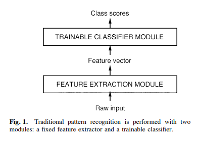
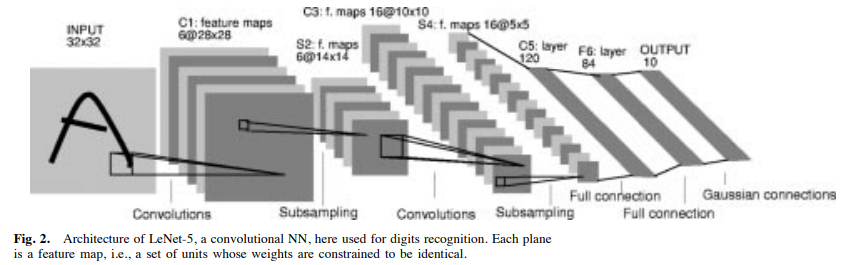
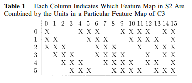
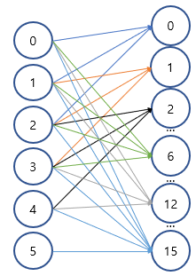

# [LeNet-5](https://axon.cs.byu.edu/~martinez/classes/678/Papers/Convolution_nets.pdf)
본 페이지에서는 LeNet-5의 등장배경과 특징에 대해서 말하고자 합니다.

---
## 1. LeNet 이전의 Classification 작업

기존에는 Pattern을 수식적으로 확인하여 이를 Classification module에 입력으로 넣어 Classifacation을 했다.

그 중 한가지 예를 들면 다음과 같다.

- 1. 입력 이미지가 주어지면 해당 입력에 대해 수학적인 방식으로 입력이미지의 특징들을 추출한다(면,선,코너 등의 정보)

- 2. 해당 특징들을 기반으로 적절한 특징들을 선별해서 해당 특징들의 벡터와 같은 추가적인 정보를 얻어낸다.

- 3. 최종적으로 이러한 정보들을 활용해 사물을 인식하는 과정을 거친다.

이러한 방식의 한계는 다음과 같다.

- 1. 특징 추출에 많은 사전지식이 포함되어 있어야 한다.

- 2. 특징 추출 과정에서 이러한 특징들을 어떻게 특징을 추출하는지에 따라 성능이 크게 달라진다.

- 3.새로운 문제(새로운 특징이 추가적으로 필요하거나 기존과는 다른 패턴이 보이는 경우)에는 다시 시스템을 구축해야함

---
## 2. LeNet-5

더 나은 패턴 인식 시스템을 만들기 위해 LeNet-5는 새로운 방식을 찾아내게 되었고 위에서 말한 단점들을 해결할 수 있게 해주는 것은 convolution neural network를 활용하는 것이다.

CNN이라고 하며 이 CNN은 기존의 방식과는 다르게 2D이미지를 일정한 지역적인 패턴을 이용하는 특수한 구조이다

다중 신경망 네트워크는 복잡하고,고차원적이고,비선형 mapping을 이미지 인식 작업에서 여러 클래스를 맞추는 작업을 통해 오차를 계산해 Gradient Descent 방법을 통해 학습한다.

LeNet-5 이전의 패턴 인식 구조에서 Feature Extraction 작업은 CNN 구조를 통해 대체될 수 있고

Classifier Module은 Fully connected layer를 통해 대체될 수 있다.

이때 CNN과 Fully Connected layer이 가능하게 된 배경은 빠른 알고리즘과 적은 비용으로도 높은 성능의 컴퓨터를 사용할 수 있게 되면서 연산량이 많은 CNN과 Fully Connected layer를 사용할 수 있게 되었다.

---
## 3. LeNet-5 구조

LeNet-5의 구조는 입력층을 제외한 7개의 층으로 이루어져 있다.

입력 이미지는 32x32로 가운데 28x28 공간에 문자의 정보가 들어있는 공간이다.

$$
Cx = Convolution layer
Sx = Sub-sampling layer
Fx = Fully connected layer
x = layer index
$$

C1 layer는 6개의 feature map들을 가지고 있는 Convolution layer이다.

각각의 feature map에 있는 유닛들은 입력에 대해서 5x5 사이즈의 kernel과 연결되어 convolution 연산을 진행한다. 

출력의 크기는 (28x28x6)이다.

S2 layer는 6개의 feature map들을 가지고 있는 Sub sampling layer이다.

각각의 feature들은 각각에 대응되는 입력 채널에 대해서 2x2 필터를 통해 4개의 픽셀 값에 대해 평균값으로 1x1의 픽셀 크기로 변한다.

이러한 이유로 C1에 비해 절반의 크기를 가진다.

출력의 크기는 (14,14,6)이다.

C3 layer는 16개의 featue map들을 가지고 있는 Convoution layer이다.

각각의 feature map들은 S2 feature map의 일부분과 각각 연결 되어 5x5 사이즈의 kernel과 연결되어 convolution 연산을 진행한다.

논문에서는 각각의 feature map이 입력으로 가져오는 채널들이 달랐지만

코드 구현에서는 그냥 간단하게 모든 채널을 입력으로 하는 것으로 하였다.

출력의 크기는 (10,10,16)이다.

S4 layer는 16개의 feature map들을 가지고 있는 Sub sampling layer이다.

S4는 S2와 비슷하다.

출력의 크기는 (5,5,16)이다.

C5 layer는 120개의 feature map을 가지고 있는 Convolution layer이다.

각각의 feature들은 S4의 출력을 입력으로 하여 5x5 사이즈의 kernel과 연결되어 convolution 연산을 진행한다.

출력의 크기는 (1x1x120)이다.

C6 layer는 84개의 feature map을 가지고 있는 Fully connected layer이다.

이 C6 결과에 대해 softmax를 적용하여 최종적인 classification을 진행한다.

출력의 크기는 ((1x1)x84)이다.

---