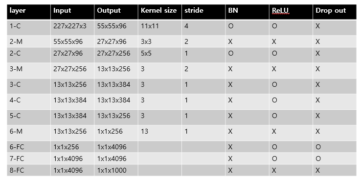

# [AlexNet](https://proceedings.neurips.cc/paper/2012/file/c399862d3b9d6b76c8436e924a68c45b-Paper.pdf)
본 페이지에서는 AlexNet의 등장배경과 특징에 대해서 말하고자 합니다.

---
## 1. AlexNet 특징
AlexNet은 기존의 논문들과는 다르게 학습 속도를 빠르게 하면서 Overfitting을 방지 하고자 하였다.

그 방법들은 아래와 같다.

- 기존의 활성함수와는 다르게 ReLU라는 활성 함수를 사용해 비선형 변환을 사용하였다.
- 빠르게 학습 하기 위해서 GPU를 활용하였다.
- Local response normalization 를 사용하여 성능을 개선하며 generalize를 실현했다.
- FC Layer(Fully Connected Layer)에 Drop out 메소드를 사용하였다.

---
## 2. 변화

## 2.1 ReLU 활성함수
ReLU 함수의 식은 다음과 같다.

$$
f(x)=Max(0,x)
$$

이러한 ReLU함수의 특징은 식이 매우 간단하다는 것이다.

기존의 tanh,sigmoid 같은 활성 함수는 gradient descent를 사용해 학습하는 동안 연산의 처리가 오래 걸렸었다.

이러한 단점을 개선 할 수 있는 비선형 변환이 가능하게 하는 함수로 ReLU라는 함수를 도입해 몇배 더 빠르게 학습이 가능해졌다.

## 2.2 여러개의 GPU 활용
하나의 GPU 메모리로는 학습하는 과정에서 메모리의 제한이 발생할 수 있다.

이러한 문제를 해결하기 위해 GPU를 병렬로 설치 하였고 각 GPU에 연산을 나누어 처리 하고 결과를 분리하거나 합치는 연산을 하여 학습을 진행한다.

## 2.3 Local response normalization
ReLU만으로도 충분한 학습이 되기도 하고 정규화가 필요 하지 않지만  추가적인 성능 향상을 위한 방법이 필요하다

local normalization을 통해 generalization을 더욱 더 확실히 할 수 있게 하려고한다.

본 논문에서는 이 방법을 사용하였지만 이를 구현하지는 않았습니다.

## 2.4 Overlapping pooling
기존의 Pooling layer들은 Pooling을 하며 지나갈 때 겹치는 부분 없이 연산을 진행 했다.

pooling layer의 ZxZ 사이즈의 filter의 중간 좌표로 부터 s 픽셀만큼 떨어진 위치로 필터의 중간 지점을 옮기다고 할 때

S=Z라고 한다면 기존의 CNN에서 흔하게 사용되는 Pooling 연산과 다를게 없다.

하지만 S<Z일 때 filter가 겹치게 되면서 Pooling 연산을 진행하게 된다.

---

## 3. LeNet-5 구조

LeNet-5의 구조는 입력층을 제외한 7개의 층으로 이루어져 있다.

입력 이미지는 32x32로 가운데 28x28 공간에 문자의 정보가 들어있는 공간이다.

Cx = Convolution layer
Sx = Sub-sampling layer
Fx = Fully connected layer
x = layer index

## C1 layer
C1 layer는 6개의 feature map들을 가지고 있는 Convolution layer이다.

각각의 feature map에 있는 유닛들은 입력에 대해서 5x5 사이즈의 kernel과 연결되어 convolution 연산을 진행한다. 

출력의 크기는 (28x28x6)이다.

## S1 layer
S2 layer는 6개의 feature map들을 가지고 있는 Sub sampling layer이다.

각각의 feature들은 각각에 대응되는 입력 채널에 대해서 2x2 필터를 통해 4개의 픽셀 값에 대해 평균값으로 1x1의 픽셀 크기로 변한다.

이러한 이유로 C1에 비해 절반의 크기를 가진다.

출력의 크기는 (14,14,6)이다.

## C3 layer
C3 layer는 16개의 featue map들을 가지고 있는 Convoution layer이다.

각각의 feature map들은 S2 feature map의 일부분과 각각 연결 되어 5x5 사이즈의 kernel과 연결되어 convolution 연산을 진행한다.

논문에서는 각각의 feature map이 입력으로 가져오는 채널들이 달랐지만

코드 구현에서는 그냥 간단하게 모든 채널을 입력으로 하는 것으로 하였다.

출력의 크기는 (10,10,16)이다.

## S4 layer

S4 layer는 16개의 feature map들을 가지고 있는 Sub sampling layer이다.

S4는 S2와 비슷하다.

출력의 크기는 (5,5,16)이다.

## C5 layer
C5 layer는 120개의 feature map을 가지고 있는 Convolution layer이다.

각각의 feature들은 S4의 출력을 입력으로 하여 5x5 사이즈의 kernel과 연결되어 convolution 연산을 진행한다.

출력의 크기는 (1x1x120)이다.

## F6 layer

F6 layer는 84개의 feature map을 가지고 있는 Fully connected layer이다.

이 F6 결과에 대해 softmax를 적용하여 최종적인 classification을 진행한다.

출력의 크기는 ((1x1)x84)이다.

---