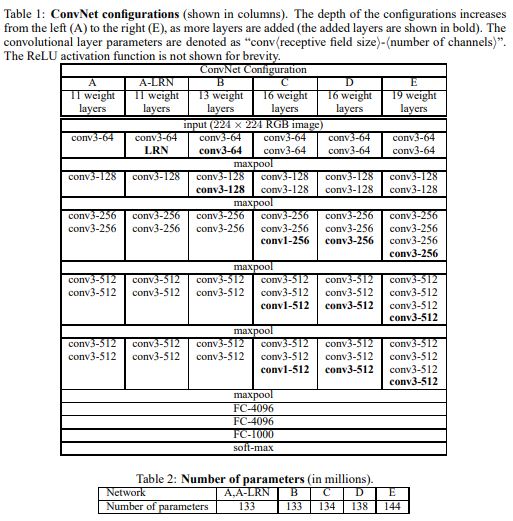

# [VGGNet](https://arxiv.org/abs/1409.1556)
본 페이지에서는 VGGNet의 등장배경과 특징에 대해서 말하고자 합니다.

---
## 1. VGGNet 특징
VGGNet 은 기존의 네트워크와는 다르게 모델의 깊이를 깊게 하여 성능을 향상시켰다.

기존의 네트워크들은 모델의 성능을 향상시키기 위해서 kernel size를 키우거나 stride를 작게 하는 방식으로 모델의 성능을 향상시키는 방법을 고려했다.

그러나 본 논문에서는 3x3 size의 kernel size를 주로 사용하여 성능을 향상 시킴과 동시에 파라미터 수를 줄이고 깊이를 깊게 하였다.

## 2 3x3 Convolution
VGGNet은 3x3 사이즈의 kernel을 많이 사용하였는데 그 이유는 다음과 같다.

5x5 conv layer를 한번 쓰는 것과 3x3 conv layer를 두번 쌓는 것과 같다고 볼 수 있고 7x7 conv layer는 3x3 conv layer를 세번 쌓은 것과 같다고 볼 수 있다.

이때 3x3 conv layer를 세번 사용하는 것이 7x7 conv layer를 사용하는 것보다 나은 이유를 설명하면 다음과 같다.

7x7 conv layer를 한번 사용하면 비선형 변환을 한번 하게 되자만 3번의 3x3 conv layer를 사용하게 되면 세번의 비선형 변환이 가능하다.

또한 conv layer를 지난 후의 채널의 수가 C라고 할때 

3개의 3x3 conv layer의 파라미터 수는 다음과 같고

$$ 
3(3^2xC^2) = 27xC^2 
$$ 

7x7 conv layer의 파라미터 수는 다음과 같다.

$$ 
7^2xC^2 = 49xC^2 
$$

추가적으로 본 모델에서는 1x1 conv layer가 존재하는데 이는 비선형 변화를 늘리기 위해 주로 사용하였다.

## 3. 구조

### Convolution Layer
이미지는 매우 작은 3x3 size kernel 을 이용해 Convolution 연산을 진행한다. 이때 stride는 1이며 입력에 대해 zero padding을 추가한다.

### Spatial Pooling
Pooling Layer는 일부 Convolution Layer 뒤에 적용된다.

kernel size는 2x2 이며 stride는 2로 하여 MaxPooling 연산을 진행한다.

### Fully Connected Layer
마지막 Convolution Layer 뒤에 세개의 Fully Connected Layer를 적용한다.

처음 두개의 FC Layer는 4096개의 채널을 가지고

세번째는 1000개의 클래스에 대해서 1000개의 채널을 가지고 softmax를 적용한다.

## 4. 상세구조

위의 table1은 열마다 다른 깊이의 모델을 보여주며 ABCDE로 나누고 각각의 다른 점은 깊이만 다른 것이다.

각 모델의 첫 채널은 64로시작하며 최종적으로 512까지 늘린다.

Table 2는 각 모델의 파라미터 수를 나타내고 깊이는 깊어졌지만 다른 얕지만 큰 kernel size를 사용한 모델보다는 weight의 수가 크지 않다.

## 5. GoogleLeNet과 다른 점

모델의 깊이가 깊어질 수록 성능이 좋아진다는 것은 이미 증명이 되었지만.

GoogleLeNet은 22개의 레이어를 3x3,1x1,5x5 conv layer를 모두 골고루 사용하였다.

GoogleLeNet은 VGGNet 구조보다 복잡하고 첫번째 레이어를 지난 뒤의 이미지 크기가 너무 많이 감소된다.

---