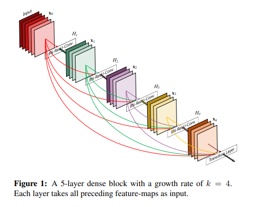
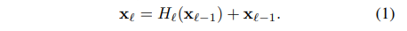
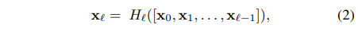
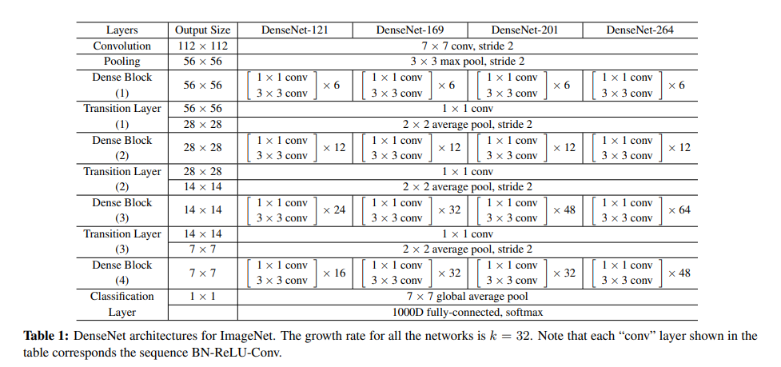

# [DenseNet](https://arxiv.org/abs/1608.06993)
본 페이지에서는 DenseNet의 등장배경과 특징에 대해서 말하고자 합니다.

---
## 1. DenseNet 특징
당시 성능이 좋아진 모델들의 구조를 살펴보면 input과 output layer에 shortcut connection 구조가 있는 모델들이 많다.(Resnet ,Highway network ,FractalNet 등)

Skip connection을 통해 gradient vanishing/exploding 문제가 해결됨었었고 이를 통해 모델의 깊이의 제한이 사라졌다.

DenseNet 또한 skip connection을 통해 성능 향상을 이루었다.

DenseNet은 하나의 stage 내에 있는 블록들은 모두 입력으로 쓰인다.

아래의 사진은 한 블록 내의 모든 레이어를 보여준다.

기존의 네트워크는 깊이가 L이라면 L개의 connection을 가졌지만 DenseNet은 L(L+1)/2개의 connection을 가졌다.

이러한 구조 때문에 DenseNet은 거의 모든 정보가 네트워크 내에서 모두 사용되어 질 수 있도록 하였다.

또한 하나의 레이어가 아닌 모든 레이어와 연결되어서 global state를 확인 할 수 있게되었고 feature map의 재사용이 가능해진다.

DenseNet의 구조는 다른 네트워크보다 적은 파라미터를 요구하고 필요없는 feature map을 다시 학습 시킬 필요가 없다.

## 2. ResNet 1202
기존의 Resnet구조를 변형시켜서 1202개의 레이어까지 쌓은 Resnet 구조이다.

Resnet 1202는 학습을 하는 중에 무작위로 일부 레이어를 버리는 구조를 사용하였다.

이론상으로는 레이어를 버리게 되면 성능이 떨어져야 하지만 오히려 성능이 향상되는 결과를 보인다.

이를 통해 모든 레이어는 무조건 필요한 것이 아니고 network의 레이어에서 중복된 레이어가 존재함을 보여준다.

이 때문에 정보의 흐름 속에 손실(불필요한 레이어로 인한)이 생긴다.

## 3. ResNet VS DenseNet

### ResNet

위의 식은 ResNet의 skip connection 식으로

Xn을 n번째 레이어의 output이라고 할 때 위 식에서 볼 수 있듯이 N번째 레이어는 N-1번째 레이어와 연결된다.

이때 add연산으로 레이어를 구성하기에 정보의 흐름에 방해가 된다.

### DenseNet

위의 식은 DenseNEt의 skip connection 식으로

n번째 레이어는 0~n-1번째 레이어 모두와 연결된다.

이때 []는 Concatenate 연산을 의미한다.

### Add vs Concatenate

Add 연산의 경우 두 결과의 값을 그냥 더하는 것이다. 즉 input들에 대해서 채널과 이미지의 크기가 같아야 함
Ex) (400x400x3) + (400x400x3) -> (400x400x3)

Concatenate연산의 경우는 두 이미지를 붙이는 연산이다. 즉 input들에 대해서 채널의 크기는 상관없이 이미지의 크기만 맞으면 된다.
Ex)(400x400x3) + (400x400x15) -> (400x400x18)

이때 add 연산 대신 concatenate연산을 통해 skip connectio을 구성하는 경우 장점은 add 연산은 input들을 값들을 더해주는 방식이어서 특징들을 제대로 보존하지 못하지만 

concatenate 연산의 경우 채널들을 그대로 붙여주기 때문에 input들의 특징을 보존할 수 있다.

## 3. 구조

### Composite function

본 논문에서 H()는 BN->ReLU->3x3 conv로 구성한다. 이러한 연산은 기본적인 DenseNet에서만 사용할 것이다.

### Pooling layer

Concatenate연산은 채널수는 달라도 되지만 feature map의 크기는 동일해야 한다.

본 논문에서는 transition 레이어를 구성하여 down sampling 레이어를 구현하였다.

Transition 레이어는 Dense block 사이에 존재하며 Bn->ReLU-> conv(1x1)연산을 진행하는 conv layer와 avg pooling(2x2)연산을 하는 pooling layer로 구성되어 있다.

### Growth rate

H()연산이 K개의 feature map을 만들어내면 L번째 레이어는 k0+k*(l-1)개의 인풋을 갖는다. (이유를 이후에 설명)

K0는 처음 입력 레이어의 입력 채널이다.

기존의 네트워크들과 DenseNet의 차이점은 좁은 레이어로도 상당한 성능을 낸다.(k=12일 때도)

본 논문에서 k는 하이퍼 파라미터로 growth rate를 나타낸다.

### Bottleneck Layers

비록 모든 레이어가 k개의 feature map output을 낸다고 하여도 입력은 더 많다.

3x3 conv 이전에 하는 1x1 conv를 bottleneck layer라고 하고 이 bottleneck layer는 3x3 conv의 input feature map을 줄이는 역할을 하고 이 때문에 computational 효율성이 증가한다.

그래서 H()라는 함수를 BN-ReLU-conv(1x1)-BN-ReLU-conv(3x3)으로 정의하면 이를 DenseNet-B라고 한다.

이때 1x1 conv연산의 output 의 feature map 수는 4k이다.

### Compression

모델의 compactness를 향상하기 위해 trainsition layer의 feature map의 수를 감소시킬 수 있다.

Dense block의 결과가 m개의 feature map을 가지고 있을 때 transition layer의 결과는  floor(θ*m)개의 feature map을 가진다.

이때 θ(0< θ<=1)이고 θ=1이라고 하면 transition layer를 지난 feature map의 수는 변하지 않을 것이다.

θ <1인 경우를 DenseNet-C라고 할 것이고, 논문에서는 θ=0.5로 지정하여 사용하였다.

또한 bottleneck 과 θ<1인 모델을 DenseNet-BC라고 하였다.

## 4. 상세구조

본 논문에서는 기본적인 Densenet은 세개의 Dense block들을 사용하고 각 block들은 같은 수의 layer를 가짐

기본적인 DenseNet에서는 첫 Dense block에 들어가기 전 output channe은 16이고 DenseNet-BC에서는 growth rate의 두배가 된 값이다.

모든 3x3 conv 연산은 테두리가 zero padde된 input 들을 사용한다.

Transition block에서는 1x1 conv연산이후에 2x2 avg pooling을 진행한다.

세가지 Dense block들의 feature map size는 32x32,16x16,8x8이다.

기본 DenseeNet 구조에서는 {L=40,k=12}, {L=100,k=12}, {L=100,k=24} 으로 실험을 진행 했고 Densenet-BC에서는 {L=100,k=12}, {L=250,k=24}, {L=190,k=40}으로 하여 성능을 평가하였다.

DenseNet-BC에서 입력 이미지는 224x224x3이고 4개의 dense block 을 사용하였다. 또한 초기 conv layer는 7x7사이즈의 kerne과 strid는 2로 하고 output channel 수는 2k로 한다. 다른 layer의 모든 output channel의 수는 k로 설정한다.

### Growth rate

위의 사진을 통해 채널 수에 대해서 얘기를 하면 다음과 같다.

본 사진을 보면 
Input->x0->h1->x1->h2->x2->h3->x3->h4->x4->transition

을 보이고 있는데 input 과 x들의 채널을 보면 각각

2->4->4->4->4->4이다 

이때 각 H의 입력을 보면 다음과 같다.(H()는 결과 채널이 4다)
X0 = H(input)
X1 = H([input,x0])
…
X4 = H([input, x0,x1,x2,x3])

X0를 보면 H에는 input이 들어가므로 입력 채널의 수는 2다
X1을 보면 H에는 input과 ,x0가 concate돼서 입력채널의 수는 6이다
…
X4를 보면 H에는 input,x0,x1,x2,x3가 concate돼서 입력 채널의 수는 18이다.

이렇게 입력 채널의 수는 k0+k(l-1)이라고 보면 된다.

---