# [SENet](https://arxiv.org/abs/1709.01507)
본 페이지에서는 SENet의 등장배경과 특징에 대해서 말하고자 합니다.

---
## 1. SENet 특징
기존의 Network들은 깊이를 늘리 거나 Layer의 관계를 수정하면서 모델의 성능을 향상시키는 방법을 생각했다.

SENet은 기존의 방식과는 다르게 채널들의 관계를 토대로 성능을 향상시키는 방법을 생각해냈다.

Layer의 구조를 변경시키는 것이 아닌 채널간의 특징을 파악하고 채널 사이의 상호 종속 특징들을 명시적으로 모델링하면서 그에 맞게 재조정 한다.

새로운 layer 구조를 만드는 것이 아니라 채널간의 관계를 변경하는 것이기에 다른 SOTA 모델들에 추가하는 방식으로 성능을 향상시킬 수 있다.

또한 SEBlock을 추가한다고 해서 computational cost가 크게 증가하지 않으면서 모델의 성능은 크게 향상된다.

## 2. SEBlock

SEBlock의 구조는 다음과 같다.

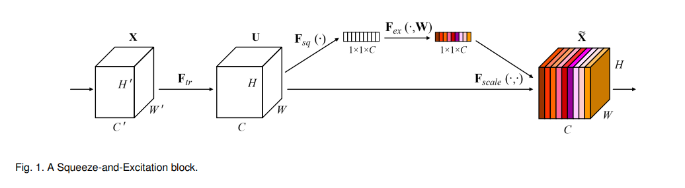
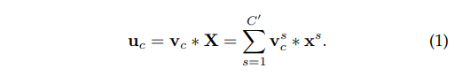

Ftr 은 그냥 Conv 연산을 의미한다.
식 (1)은 각 채널별 conv연산을 말하는데
X=[x1,x2,x3,…,xc]로 입력들을 의미하고
V=[v1,v2,v3,…,vc]를 의미한다
U=[u1,u2,u3,..,uc]는 결과를 의미한다.
Ftr은 기존 Network들의 일반적인 conv 연산이라고 보면된다.

### 2.1 SEBlock 특징
SEBlock은 세가지의 연산으로 이루어져있는데(squeeze, excitation, scale)(본 논문에서는 exicitation과 scale을 같은 단계에서 처리함)

Squeeze는 입력의 각 채널의 모든 값들을 하나로 줄여서 (H,W,C)의 모양을 (1,1,C)의 모양으로 바꾸어준다.

Excitation은 Squeeze의 결과를 특정한 연산을 거쳐 각 채널별 값들을 재조정 해준다.

Scale은 기존에 있던 값에 Excitation값을 채널마다 곱해주는 연산을 한다.

### 2.2 Squeeze: Global Information Embedding

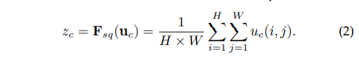

Squeeze 단계는 말 그대로 압축하는 단계이다 각 채널의 값들 즉 특징들을 특정 연산을 통해 하나의 값으로 만들어버리는 것이다.

본 논문에서는 Global Avg Pooling 연산을 통해 각 채널의 값들의 평균을 내서 해당 채널의 전반적인 값의 크기를 구함.

Global Avg Pooling을 진행하면 (H,W,C)의 크기가 (1,1,C)로 줄어들게 되어 각 채널별 특징을 간단하게 볼 수 있음

Z 는 각 채널의 값을 의미함

### 2.3 Excitation: Adaptive Recalibration

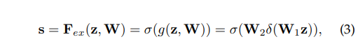

Squeeze 연산에서 aggregate된 값들을 재조정하여 채널별 의존성을 확실하게 확인하게 된다.

값 s는 각 채널별 최종 가중치라고 할 수 있다. 아래의 식 (3)에서 W1과 W2는 FC Layer를 의미하고 δ는 ReLU σ는 Sigmoid이다.

이때 W1을 지난 채널 값은 reduction ratio(r) 의 값으로 입력 레이어의 수를 나눈 값으로 C/r개의 채널을 output으로 낸다.

W2를 지난 채널 값은 다시 C개의 채널로 돌아가게 하는 bottleneck 구조로 간다.

이때 r은 hyperparameter이고 bottleneck구조로 만든 이유는 파라미터의 수도 줄이며 일반화를 도와주며 결국 복잡도를 줄이게된다.

### 2.4 Scale

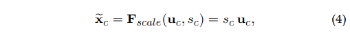

이전의 연산을 통해 얻은 모든 S=[s1,s2,…,sc]들을 U와 곱하여 U를 재보정 해준다.

즉, 각 채널 간의 특징들을 토대로 채널 간의 가중치 값을 구해서 곱해줌에 따라 채널값의 중요도를 재구성해준다.

## 3. SEBlock 적용 예 (ResNet Module,Inception Module)

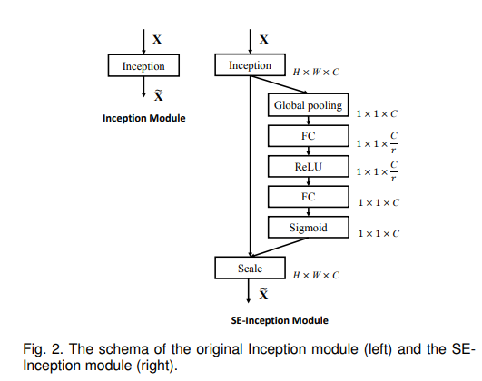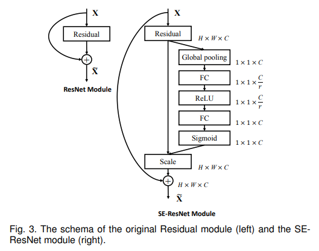

SE block은 각각의 conv연산 이후 비선형 변환 이후에 삽입되어 기존의 네트워크와도 연결될 수 있다.

### ResNet with SEBlock

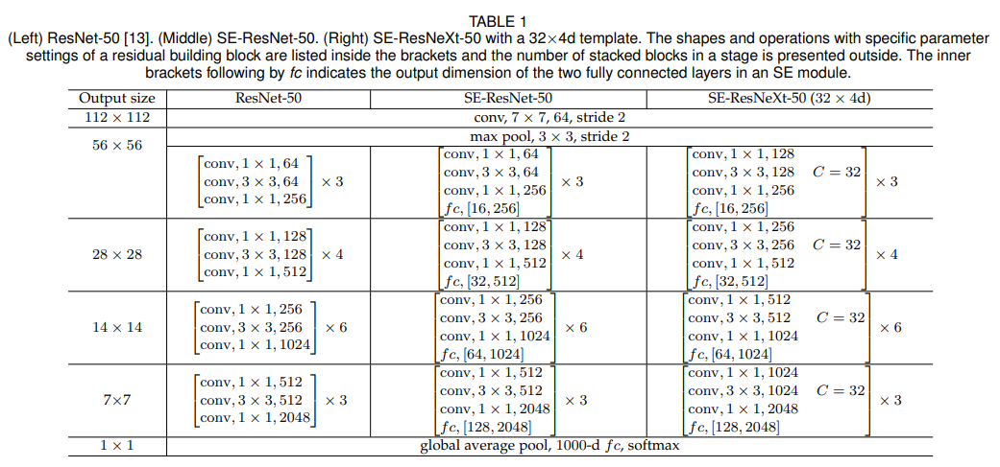

ResNet 구조에 SEBlock을 적용하는 table이다.

본 표에서 SE-ResNet-50에 있는 fc,[16,256]은 SEBlock의 두 FC layer의 출력 채널 수를 의미한다.

## 4. 하이퍼 파라미터

### 4.1 Reduction ratio(r)

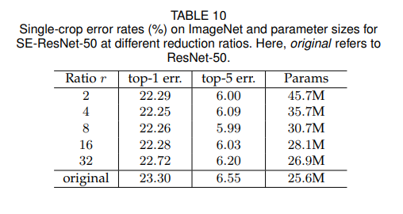

R값의 조정으로 인해 SE block의 성능과 복잡도가 다양해진다.

Ratio가 낮을 때는 파라마티어 수가 크게 증가한다.

Table 10의 결과를 통해 r값에 의해 성능이 robust해짐을 볼 수 있는데.

논문에서 사용한 SE resnet에서는 r=16을 사용하였고 이때가 정확성과 복잡성 사이에서 적절한 균형을 찾은 지점이다.

모든 network에 대해서 동일한 ratio의 사용은 오히려 악효과이다. 각각의 레이어가 다르기떄문에

각각의 네트워크 구조에 따라 ratio를 적절히 수정해주면서 값을 찾아야 한다.

### 4.2 Squeeze Operator

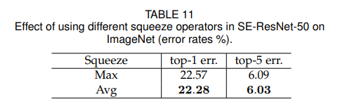

본 논문에서는 Global Avg Pooling(GAP)연산을 주요하게 사용했는데 Global Max Pooling(GMP)연산의 선택지도 있었다.

각각의 선택지에 대한 성능표는 table 11에서 보여준다.

Global Avg Pooling이 더 효과적이지만 둘다 robust한 결과를 낸다.

### 4.3 Excitation Operator

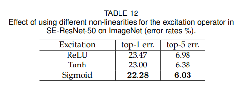

Excitaion mechanism에서 비선형 함수를 선택하는 것에 대해서 고려를 해보았다.

ReLU 함수와 Tanh함수를 sigmoid 함수 대신에 사용해보았고 결과는 table 12에서 보여준다.

SE block이 더 효과적이기 위해서는 Excitation 연산을 좀 더 주의 깊게 고려해야한다.

### 4.4 Different stages

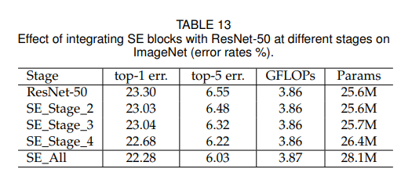

Resnet-50 에서 SE Block들을 각각 다른 Stage에 합치는 것이 어떤 영향을 끼치는지 확인해보았는데 표에서 확인해보면 된다.

### 4.5 Integration strategy

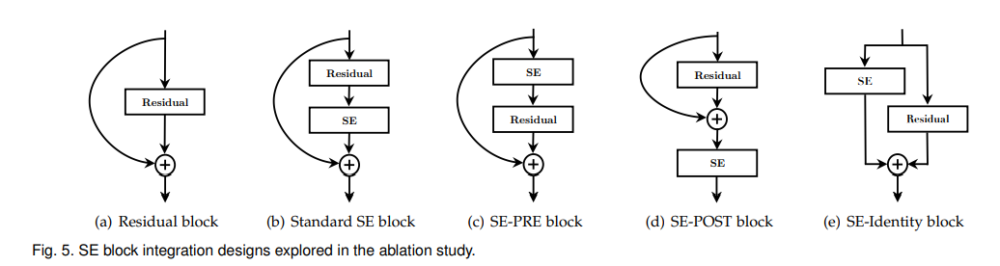
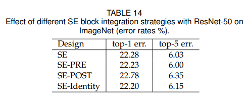

### 4.6 SE block의 위치(내부)

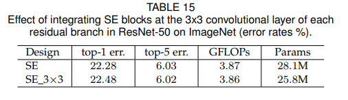

4.5에서는 residual block 외부에서 Seblock을 배치했지만 이번에는 Residual block 내부에 적용을 할 때다.

SE block을 3x3 conv layer 이후에 적용을 해보았다.(3x3 layer conv 이후에 설치한 이유는 1x1 conv 이후에는 파라미터 수가 크게 증가하기 때문이다.)

기존의 방법보다는 성능은 비슷하나 파라미터 수가 줄었다

---