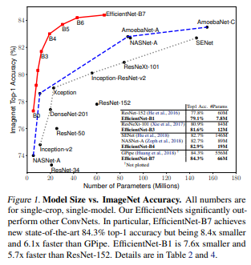
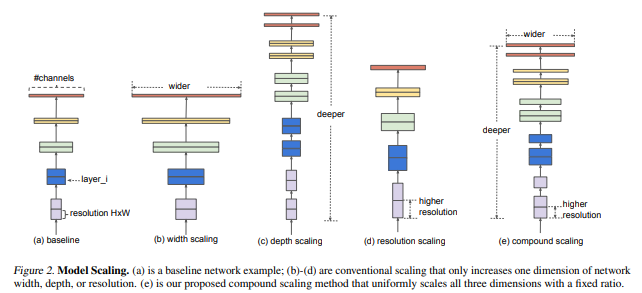
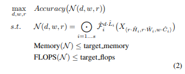
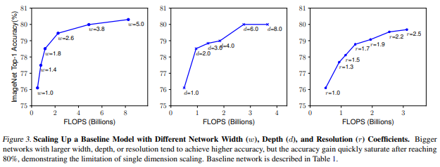
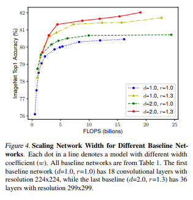
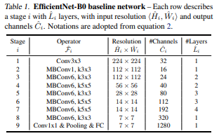

# [EfficientNet](https://arxiv.org/abs/1905.11946)
본 페이지에서는 EfficientNet의 등장배경과 특징에 대해서 말하고자 합니다.

---
## 1. EfficientNet 특징

기존의 CNN은 고정된 자원 한계에서 발전되어 왔고 더 많은 자원을 사용할 수 있으면 성능이 향상될 수 있었다.

기존의 방법에는 네트워크의 너비(한 레이어의 필터의 수),깊이(레이어의 깊이),해상도(feature map의 크기) 중 하나에만 집중했다. 대표적인 예로 Resnet과 같이 깊이에만 집중하여 성능을 향상시키는 방법을 생각함

본 논문에서는 너비,깊이,해상도를 모두 조정(scaling)해서 성능을 향상시키는 방법을 찾으려 했다.

이러한 방법을 통해 다른 모델에 비해 8.4배 작고 6.1배정도 빠른 모델이 되었다.

EfficientNet은 너비,깊이,해상도를 모두 고려하여 수치를 조정하는 것을 식으로 만들어서 균일하게 수치를 조정하였다.

만약 computational 자원을 X^n배 만큼 자원을 사용하려고 한다면 간단하게 네트워크의 깊이를 a^n,너비를B^n,해상도를 r^n만큼 늘린다.

다음의 그림에서 (e)가 EfficientNet의 방식으로 모든 차원을 고려한 것이다.

## 2. Problem Formulation

모든 모델에서 기존의 conv연산 방법(Resnet에서의 residual method와 같은)은 변화주지 않으면서 채널의 수(C),레이어의 수(L), 해상도(H,W)에 변화를 줄 것이다.

즉 제한된 자원 내에서 H,W,C,L에 변화를 주어 모델의 성능을 최대화 하는 방법을 찾는다는 것이다.(식(2)에서 N(d,w,r)은 모델 최종 결과라고 보면 된다.F는 conv연산,relu와 연산이고 X는 초기 입력이다.d , w, r은 각각 깊이,너비,해상도에 대한 coefficient이다.)

식(2)의 주요한 문제는 d,w,r은 서로 종속적이기에 하나가 변하면 다른 요소도 변하기에 어려움이 생겨 기존의 방법들에서는 하나만을 변경하여 성능을 향상시키려 하였다.

이를 고려하여 d,w,r을 고려하는 방법은 아래와 같다.

### 2.1 Depth(d)

Network의 깊이를 조정하는 것은 기존에 많이 사용하던 방식이다.

깊은 convnet은 풍부하고 복잡한 feature들을 잘 확보하고 새로운 작업에서도  괜찮은 generalize가 된다.

그러나 깊은 network는 vanishing gradient문제가 발생한다.

이런 문제는 skip-connectio과 BN을 통해 어느정도 해결이 되었지만 
Resnet-152와 Resnet-1000이 성능에 큰 차이가 보이지 않을 만큼 제한이 있다.

### 2.2 Width(w)

Network의 너비를 조정하는 것은 작은 network에서 흔히 사용한다.

너비가 넓은 network들은 fine-grained된 feature들을 얻어낼 수 있고 학습하기도 쉽다.

그러나 넓은 network이면서 깊이가 얕은 network는 high level feature들을 얻기 힘들다.

### 2.3 Resolution(r)

고해상도의 input image의 경우 convnet은 fine-grained 된 패턴을 얻을 수 있다.

기존의 convnet은 224x224로 시작해 정확성을 위해 480x480까지 시도를 하였고 Gpipe라는 모델은 이 해상도로 sota모델이 되었다.

600x600같은 고해상도는 object detection에서 자주 쓰인다.

### 2.4 d,w,r에 대한 성능관계

Observation 1 - network의 너비 깊이 해상도의 어떤 차원이라도 scaling up하는 것은 정확성을 향상시키지만 , 크게 변화시킨 모델들에서는 정확성의 향상이 점점 줄어들어 수렴하게 된다.

## 3. Compound Scaling

해상도가 커질수록 커진 이미지에 대해서 더 많은 feature들과 패턴을을 찾아내기 위해서 네트워크의 너비와 깊이를 같이 늘려야한다. 이러한 관계는 Fig(4)에서 잘 보여진다.

d와 r의 변화없이 w만 변화시킬 경우 성능의 향상이 빠르게 수렴된다.

d와 r과 함께 w를 변화할 경우에는 같은 FLOPS로도 더 나은 성능을 보인다.

Observation 2 - 더 나은 정확도와 효율성을 보여주려면,CNN을 조정 하는 중에 network의 너비,깊이,해상도 값 사이에서 균형점을 찾는 것이 좋다.

기존에 이미 balance를 찾는 노력은 있었지만 정해진 방식대로 balance를 찾는 것이 아니기에 계속 수정을 해주었다.

본 논문에서는 해당 방식을 식으로 만들어 균일하게 조정을 하려고 한다.(φ라는 compound coefficient를 사용)

Φ값은 사용자가 지정할 수 있는 하이퍼 파라미터로 얼마나 자원을 사용할지에 따라 정할 수 있다.

식(3)에서 a,B,r는 small grid search로 인해 정해지는 constant이다.

φ 는 a,B^2,r^2와 비례한다.

이때 FLOPS는 2^ φ와 비례한다.

## 4. EfficientNet Architecture
모델 scaling이 baseline network의 연산 Fi(x)를 변화시키지 않기 때문에 좋은 baseline network를 찾는 것이 중요하다.

Scaling method를 기존의 모델에 적용해 성능을 평가한다.

정확도와 FLOPS를 둘다 평가하기 위해서 optimizer를 ACC(m)x[FLOPS(m)/T]^w로 설정하였다.

ACC(m)과 [FLOPS(m)/T]^w은 각각 모델 m의 정확도와 FLOPS를 의미한다, T는 목표 FLOPs이고 w=-0.07은 FLOPS와 accuracy 사이에 trade off를 제어하기 위한 하이퍼 파라미터다

### 4.1 EfficientNet Architecture(EfficientNet-B0)

architecture는 MnasNet을 참고하여 만들었다.

EfficientNet의 주요한 building block은 mobile inverted bottleneck Mbconv이고, 또한 SE optimization을 같이 사용했다.

compound scaling 방법을 다음과 같은 두가지 step을 적용하여(B1~B7을 얻음).

STEP 1: φ를 1로 고정하고,두배 더 많은 리소스를 사용가능하다고 가정한다,그리고 a,B,r에 대해 식 2와 3을 기반으로 small grid search를 진행한다,특히  EfficientNet-B0의 가장 좋은 값은 a=1.2,B=1.1,r=1.15인걸 a'B^2'r^2=2에서 찾았다.

STEP 2:  a,B,r을 constants로써 고정했고 식 3을 사용하여 다른 φ과 함께 baselin network를 scale up 하였다.

a,B,r를 찾는 것은 효율적이나 커진 모델에서는 search 비용이 커졌다.

(step1)방법에서 작은 baseline networ에서 search를 한번만 하면서 이러한 문제를 해결했다.

그리고 모든 다른 모델들에서 같은 scaling coefficient들을 사용했다.(step2)

---