# [MobileNet](https://arxiv.org/abs/1704.04861)
본 페이지에서는 MobileNet의 등장배경과 특징에 대해서 말하고자 합니다.

---
## 1. MobileNet 특징
MobileNet은 mobile과 embedded vision application에서 효과적인 모델이다.

기존의 conv 연산과는 다른 depthwise separable conv 연산을 새로 고안하여 더욱 더 가벼운 network를 만들었다.

기존의 네트워크들은 모델 사이즈를 줄이는 데에만 관심이 있었지만 속도에는 관심을 두지 않았다

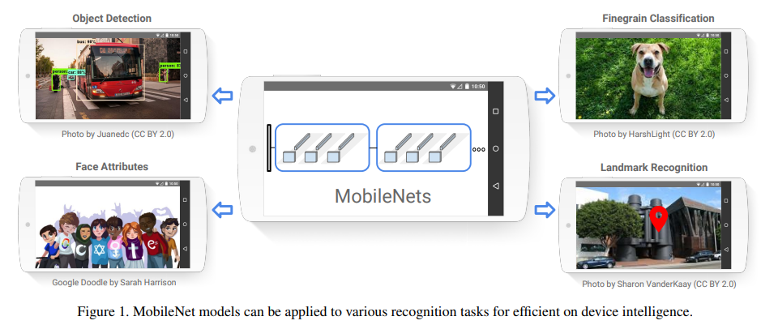

### 정의

F:입력 tensor

G:출력 tensor

K:kerne의 tensor

D:입출력의 spatial dimension(2D이미지의 경우 너비,높이)

M,N: 각각 입력 출력의 채널 수

이때 논문에서는 output feature map은 input과 같은 spatial dimension을 가진다고 가정하였고 둘 다 정사각형이라고 가정하였다.

## 2. Convolution

MobileNet은 depthwise Separable Convolution 연산을 사용했는데 이를 이해하기 위해서는 각 Convolution 연산에 대해 알아야 한다.

### 2.1 Spatial Convolution
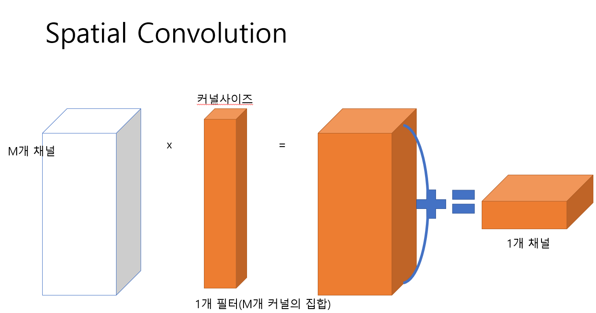
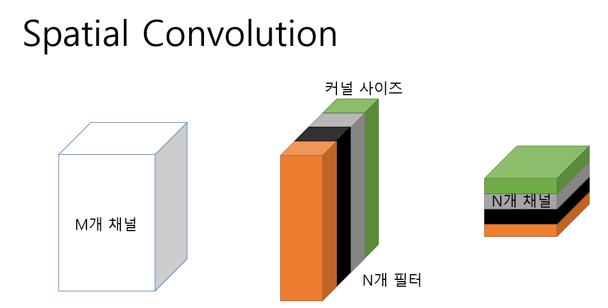
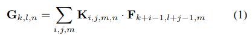

가장 기본적인 Convolution 연산으로 기존의 논문들은 대부분 이 Convolution 연산을 사용했다.

이때 pointwise Convoltuion 연산은 spatial convolution 연산의 kernel size를 1x1로 줄인 연산이라고 할 수 있다.

이때 computational cost는 다음과 같다.
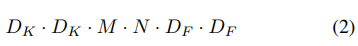

### 2.2 Depthwise Convolution

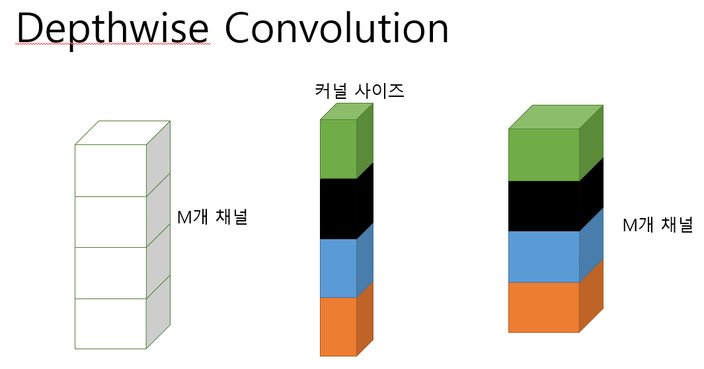
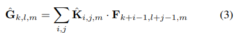

기존의 Convolution 연산은 하나의 feature map은 모든 입력 채널의값들에 대한 kernel의 집합이 여러개 이지만

Depthwise convolution 연산은 하나의 채널에 대해서 하나의 kernel만 사용한 결과를 하나의 출력으로 한다.

이러한 특성때문에 기본 Convolution 연산보다는 효율적이지만 각 채널당 하나의 kernel만을 사용하기에 새로운 feature를 형성하기 어렵다.

이때 computational cost는 다음과 같다.
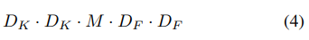

### 2.3 Depthwise Separable Convolution

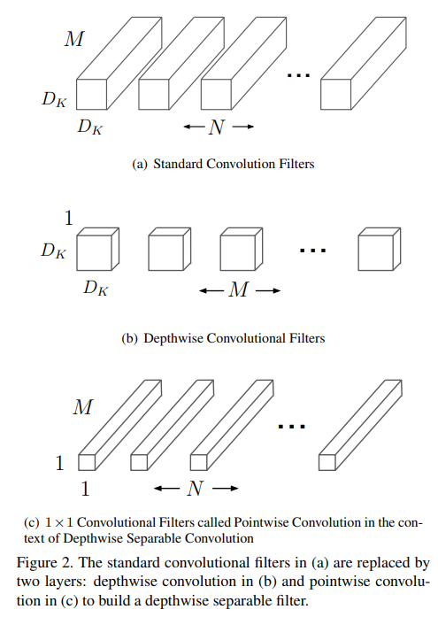

기존의 Conv연산을 Deptwise Conv-> pointwise conv로 재구성 하는 것이다.

Depthwise Convolution의 문제는 새로운 feature map을 형성하기 어렵다는 것이었다.

이러한 문제를 해결하기 위해 1x1 Convolution(Pointwise Convoloution) 연산을 Depthwise Convolution의 결과에 취해주어 여러 feature 들을 결합해 새로운 feature를 생성하여 문제를 해결했다.

이때 computational cost는 다음과 같다.

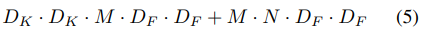

### 2.4 Computational Cost

기존의 Convolution 연산과 Depthwise Separable Convolution 연산의 Computational cost를 이용해 비율을 구해보면 다음과 같다.

만약 3x3의 Kernel을 통해 Convolution을 한다면 기존의 것보다 Depthwise Separable Convolution 연산이 대락 8~9배정도 더 적은 Computational cost를 사용한다.

이때 Depthwise Convolution과 Pointwise Convolution으로 재구성 하는 과정에서 추가적인 Computational cost가 발생하지만 이는 매우 작으므로 무시할 수 있다.

## 3. 네트워크 구조

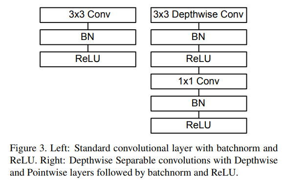

기존의 3x3 Conv를 Depthwise separable Conv 연산으로 바꾼 것이다.

이러한 구조를 적용한 상세한 표는 다음과 같다.

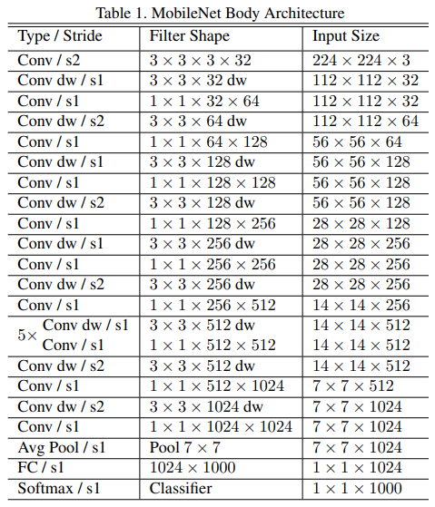

### 3.1 Network structure and training

첫 Convolution layer를 제외하곤 모두 Depthwise Separable Convolution으로 레이어가 이루어진다.

모든 layer는 BN ReLU를 따르고 FC Layer는 비선형 변환 없이 바로 softmax layer로 넘어간다.

Down sampling은  depthwise conv와 첫 layer strided convolution을 통해 적용된다.

마지막 avg pooling은 부분 해상도를 1로 FC Layer 이전에 줄인다.

Mobile net은 1x1 conv에서 95% 의 computation time을 쓰고 또한 75%의 파라미터만을 사용한다(Table2에서 보여짐)

거의 모든 추가적인 파라미터는 FC Layer에서 만들어진다.

general matrix multiplay(GEMM)에 대한 내용도 논문에 있음

### 3.2 Width multiplier: Thinner Models

비록 작지만 더 빠르고 더 작은 모델이 요구된다.

매우 간단한 파라미터인 a를 width multiplier라고 불리는 소개한다.

a의 역할은 각각의 layer에서 network를 uniformly하게 얇게 하는 것이다.

주어진 레이어와 a에 대해서 input channel의 수 M에 대해서 aM이 되고 output channel의 수 N에 대해서 aN이 된다.

a를 사용한 computational const는 식(6)에서 나온다

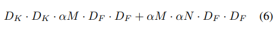

a 의 범위는 (0,1]이고  전형적인 세팅 값은 1,0.75,0.5,0.25 이고 mobilenet의 baseline은 1이고 a<1인 경우는 reduced된 mobilenet이다.

a는 computational cost와 파라미터 수의 거의 a^2만큼 영향을 준다.

### 3.3 Resolution Multiplier: Reduced Representation

두번째 Computational cost를 줄이기 위한  하이퍼 파라미터는 resolution multiplier p이다.

이것을 input 이미지와 모든 레이어의 internal representation에 적용했다.(같은 multiplier에 의해 subsequently 줄어듦)

실전에서 우리는 p를 명시적으로 설정한다.(input 해상도를 설정하면서)

p를 사용한 computational cost를 식(7)을 통해 보여줄 수 있다.

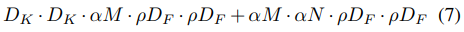

p의 범위는 (0,1]이고  네트워크의 input 이미지의 해상도는 224,192,160 또는 128이다.

p=1이 baseline mobile net이고 p<1인 경우에는 reduced computation mobilenet이다.

p는 computational cost에 p^2만큼 영향을 준다.

---