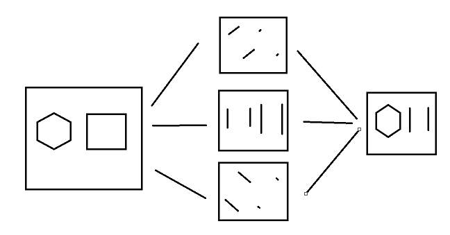
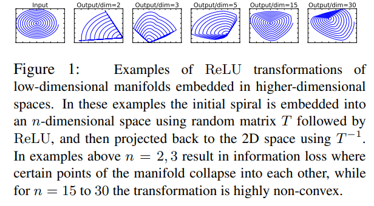

# [MobileNet V2](https://arxiv.org/abs/1801.04381)
본 페이지에서는 MobileNet V2의 등장배경과 특징에 대해서 말하고자 합니다.

---

## 1. MobileNet V2 특징

기존의 Residual structure와는 다른 Inverted Residual structure를 제안하였다.

특히 ReLU함수와 같은 비선형변환 함수를 사용함에 따라 정보의 손실이 발생하는 경우가 있는데 이 점을 활용해 일부분에 비선형 변환을 적용하지 않으며 성능을 향상 시켰다.

Mobile Net과 비슷하게 연산의 수를 줄이면서 메모리 사용량을 줄이는 방법을 목적으로 한다.

## 2. Feature of MobileNet V2

이 부분은 MobileNet V2의 주요 특징에 대해서 다루려고 합니다.

---

## 2.1 Depthwise Separable Convolution

Depthwise Separable Convolution에 대한 내용은 이전에 MobileNet V1에 대한 내용에 있습니다.

## 2.2 Linear Bottleneck

### 2.2.1 Dimensional Space

우선 본 논문의 Linear Bottleneck 부분에 대해서 이해하기 위해서는 고차원의 정보와 저차원의 정보에 대해서 이해를 해야한다.(low-dimensional space,high-dimensional space)

고차원의 정보라고 하면 우리가 어떤 고양이 사진을 보면 사진에 있는 고양이 자체는 고차원의 정보이고 고양이의 어떤 특정 정보들을 저차원의 특징이라고 한다.

즉, CNN에서 고차원의 정보라고하면 input feature 라고 하고 이러한 feature에서 추출한 정보를 저차원의 정보라고 한다.

CNN에서 Conv 연산을 통해 채널의 수를 늘리는 과정은 기존에 얻어낸 특징들로부터 더 많은 특징들을 추출하는 과정(low dimension subspace로 embedding 하는 것)이고

반대로 채널의 수를 줄이는 과정은 기존에 얻어낸 특징들을 활용해 특정 정보를 합성하는 과정(high dimension space로 embedding 하는 것)이다.

실제로는 더 복잡하게 작동하지만 간단하게 육각형을 추출하는 과정을 예로 들면 아래의 사진을 보면 알 수 있다.

## 2.2.2 DNN

DNN이 n개의 레이어 Li로 구성되어져 있고 각각의 레이어는 (hi x wi x di)의 차원을 가지고 있는 activation tensor(feature map의 개념이라고 이해했다.)로 이루어져 있다고 하면

이러한 layer activation의 집합(즉, layer들을 지나온 feature map)은 "manifold of interest"를 형성한다고 한다.

즉 모든 layer들을 지난 결과라고 보면 된다.

우리가 한 레이어 내의 하나의 채널의 픽셀들을 통해 얻어진 정보들은 또 다른 manifold에 놓이게 되고 이는 또 활용되어 새로운 low dimensional subspace에 embedding 될 수 있다.(manifold 자체는 하나의 layer에서의 결과라고 볼 수 있다.) 즉 하나의 layer를 지날 때마다 dimensionality를 줄여가며 필요한 특징을 추출해 나아간다.

MobileNetV1는 효율적으로 computation과 정확도에서 trade off를 width multiplier 파라미터를 통해 해왔었다. 특히 이런 width muliplier는 dimentionality를 줄이기 때문에 효과가 있었다.

하지만 이런 생각은 비선형 변환이 있을 때는 조금 다르게 작용하는 경우가 있다.(안좋은 쪽으로 작동함)

## 2.2.3 Non Linear Transform(ReLU)

여러가지 비선형 변환이 있는데 ReLU함수를 예를 들면 다음과 같다.

ReLU 함수의 식은 다음과 같다.

$$
ReLU(x) = max(0,x)
$$

ReLU함수는 두가지 문제점이 있는데 하나는 다음과 같다.

---

### Linear Transform

---

이때 x가 0보다 큰 경우에는 x를 그대로 출력하게 되어 선형 변환이라고 할 수 있다.

만약 하나의 레이어에서의 결과에 ReLU함수를 적용한 결과인 volume S에 대해서 0값이 없는 경우에는 입력에 대해서 선형 변환을 했다고 볼 수 있다. 

이러한 이유로 출력의 모든 dimension에 대응하는 입력 space는 선형변환으로 제한된다.
(여기서 입력 space라 함은 입력 layer의 모든 부분을 의미하는 듯 하고 출력의 모든 dimension이라 함은 입력 space들을 통해 얻어낸 출력들을 말하는 것 같다.)

즉 출력들이 선형 변환이 될 수 있다는 것을 말한다.

---