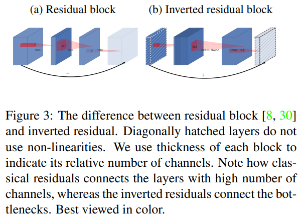
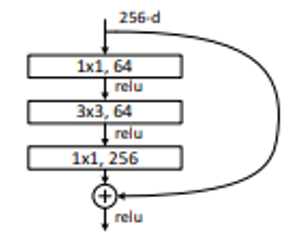
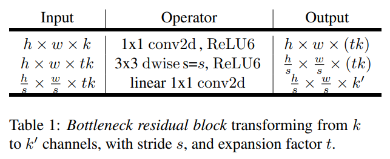
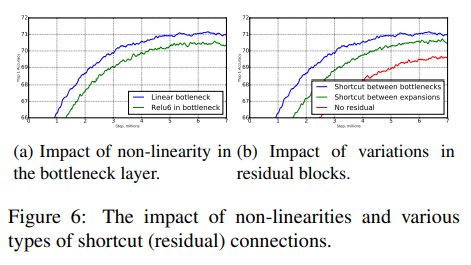
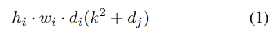
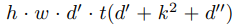
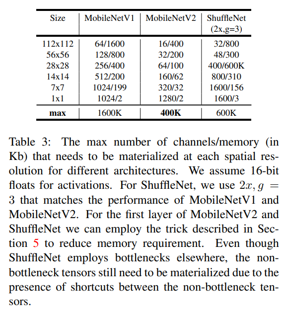

# [MobileNet V2](https://arxiv.org/abs/1801.04381)
본 페이지에서는 MobileNet V2의 등장배경과 특징에 대해서 말하고자 합니다.

---

## 1. MobileNet V2

기존에 있던 CNN들은 이미 인간을 넘어설만큼의 성능을 가진 모델들이 많이 있다.

이런 모델들의 성능은 주로 computational cost로부터 오는데 이러한 모델들은 mobile 장치와 같이 성능이 낮고 저장공간이 적은 상황에서 쓰기에 적절하지 않다.

따라서 본 논문은 MobileNet V1과 비슷하게 연산의 수를 줄이면서 메모리 사용량을 줄이는 방법을 목적으로 한다.

MobileNet V2의 특징은 간단하게 다음과 같다.

- MobileNet V1과 동일하게 Depthwise separable convolution을 사용하였다.

- 특히 ReLU함수와 같은 비선형변환 함수를 사용함에 따라 정보의 손실이 발생하는 경우가 있는데 이 점을 활용해 일부분에 비선형 변환을 적용하지 않으며 성능을 향상 시켰다.

- 위의 특징들을 활용해 기존의 Residual structure와는 다른 Inverted Residual structure를 제안하였다.

---

## 2. Detail of MobileNet V2

이 부분은 MobileNet V2의 주요 특징에 대해서 자세히 다루려고 합니다.

---

## 2.1 Depthwise Separable Convolution

Depthwise Separable Convolution에 대한 내용은 이전에 MobileNet V1에 대한 내용에 있습니다.

## 2.2 Linear Bottleneck

### 2.2.1 Dimensional Space

우선 본 논문의 Linear Bottleneck 부분에 대해서 이해하기 위해서는 고차원의 정보와 저차원의 정보에 대해서 이해를 해야한다.(low-dimensional space,high-dimensional space)

고차원의 정보라고 하면 우리가 어떤 고양이 사진을 보면 사진에 있는 고양이 자체는 고차원의 정보이고 고양이의 어떤 특정 정보들을 저차원의 특징이라고 한다.

즉, CNN에서 고차원의 정보라고하면 input feature 라고 하고 이러한 feature에서 추출한 정보를 저차원의 정보라고 한다.

CNN에서 Conv 연산을 통해 채널의 수를 늘리는 과정은 기존에 얻어낸 특징들로부터 더 많은 특징들을 추출하는 과정(low dimension subspace로 embedding 하는 것)이고

반대로 채널의 수를 줄이는 과정은 기존에 얻어낸 특징들을 활용해 특정 정보를 합성하는 과정(high dimension space로 embedding 하는 것)이다.

실제로는 더 복잡하게 작동하지만 간단하게 육각형을 추출하는 과정을 예로 들면 아래의 사진을 보면 알 수 있다.

## 2.2.2 DNN

DNN이 n개의 레이어 Li로 구성되어져 있고 각각의 레이어는 (hi x wi x di)의 차원을 가지고 있는 activation tensor(feature map의 개념이라고 이해했다.)로 이루어져 있다고 하면

이러한 레이어 activation의 집합(즉, 레이어들을 지나온 feature map)은 "manifold of interest"를 형성한다고 한다.

즉 모든 레이어들을 지난 결과라고 보면 된다.

우리가 한 레이어 내의 하나의 채널의 픽셀들을 통해 얻어진 정보들은 또 다른 manifold에 놓이게 되고 이는 또 활용되어 새로운 low dimensional subspace에 embedding 될 수 있다.(manifold 자체는 하나의 레이어에서의 결과라고 볼 수 있다.) 즉 하나의 레이어를 지날 때마다 dimensionality를 줄여가며 필요한 특징을 추출해 나아간다.

MobileNetV1는 효율적으로 computation과 정확도에서 trade off를 width multiplier 파라미터를 통해 해왔었다. 특히 이런 width muliplier는 dimentionality를 줄이기 때문에 효과가 있었다.

하지만 이런 생각은 비선형 변환이 있을 때는 조금 다르게 작용하는 경우가 있다.(안좋은 쪽으로 작동함)

## 2.2.3 Non Linear Transform(ReLU)

여러가지 비선형 변환이 있는데 ReLU함수를 예를 들면 다음과 같다.

ReLU 함수의 식은 다음과 같다.

$$
ReLU(x) = max(0,x)
$$

ReLU함수는 두가지 문제점이 있는데 하나는 다음과 같다.

---

### Linear Transform

---

이때 x가 0보다 큰 경우에는 x를 그대로 출력하게 되어 선형 변환이라고 할 수 있다.

만약 하나의 레이어에서의 결과에 ReLU함수를 적용한 결과인 volume S에 대해서 0값이 없는 경우에는 입력에 대해서 선형 변환을 했다고 볼 수 있다. 

이러한 이유로 출력의 모든 dimension에 대응하는 입력 space는 선형변환으로 제한된다.
(여기서 입력 space라 함은 입력 레이어의 모든 부분을 의미하는 듯 하고 출력의 모든 dimension이라 함은 입력 space들을 통해 얻어낸 출력들을 말하는 것 같다.)

즉 출력들이 선형 변환이 될 수 있다는 것을 말한다.

---

### Information Loss

---

만약 ReLU함수가 채널을 붕괴시키면 이는 필연적으로 해당 채널에 있는 정보의 손실을 발생시킨다.

그러나 많은 채널을 가지고 있고 activation manifold에 structure가 있다면 정보가 다른 채널에서 보존될수 있다.

이는 다음 Fig1을 통해 설명 하면 다음과 같다.

Fig1은 ReLU함수를 통해 dimensional 을 전환하는 모습을 보여준다.

각 그림에 대해서 Input에 대해서 n차원으로 embedding 하고 ReLU함수를 적용한 뒤 이를 2D 공간에 project 시킨 모습이다.

Input을 비교적 작은 차원(n=2 ,3)으로 전환 하고 ReLU를 적용한 후 2D공간에 Project 시킨 모습을 보면 나선 모양에 대한 정보가 많이 사라지고 차원이 클 수록 정보의 손실이 적어짐을 확인 할 수 있다.

즉 기존 차원보다 낮은 차원으로 변환 후 ReLU를 적용시키는 경우에 정보의 손실이 발생하는 것을 알 수 있다.

이러한 특징들은 Inverted Residual block을 구현할 때 비선형 변환을 사용 여부에 영향을 주었다.

## 2.3 Inverted residual block

Bottleneck block이 기존의 residual block과 비슷하다.

기존의 residual block은 입력의 shortcut이 expansion 레이어의 결과와 연결 된다.

본 논문에서 제안한 Bottleneck block은 shortcut이 expansion 레이어의 결과가 아닌 bottleneck 레이어의 결과와 연결된다.

이러한 생각은 residual block에서 bottleneck 레이어가 중요한 정보를 가지고 있다고 생각하고 expansion 레이어는 비선형 변환과 함께 구현에 필요한 연산을 하는 것이라는 생각을 기반으로 Inverted residual block을 구현하였다.

### 2.3.1 Residual block vs Inverted Residual block

아래의 그림은 두 구조의 다른 점을 보여준다.

본 그림에서 빗금이 그려진 부분은 non-linear function을 사용하지 않는 부분이다.

두꺼운 정도는 채널의 크기를 보여준다.

이때 Residual Block의 특징은 다음과 같다.

기존의 큰 채널에서 채널을 좁히는 bottleneck 레이어 이후에 추가적인 연산을 하고 다시 expansion 레이어를 통해 채널을 늘린다. 이후 expansion 레이어의 결과에 입력을 연결하여 shortcut을 구현한다.

즉, 좁힘->연산->늘림 방식의 연산이다.

반면에 Inverted residual block의 특징은 다음과 같다.

기존의 작은 채널에서 채널을 늘리는 expansion 레이어 이후에 Depthwies conv 이후 Pointwise conv 연산을 진행한 후 bottleneck 레이어를 통해 채널을 줄인다 이후 bottleneck 레이어의 결과에 입력을 연결하여 shortcut을 구현한다.

즉, 늘림->연산->좁힘 방식의 연산이고 기존의 Residual block과는 반대되는 특징을 가져 Inverted residual block이라 하는 것이다.

### 2.3.2 Linear bottleneck

Residual block과 Inverted Residual block의 또 다른 차이점은 비선형 변환을 사용하는 레이어도 있고 사용하지 않는 레이어도 있다는 것이다.

[### Information Loss](#information-loss) 에서 보면 비교적 작은 차원으로 전환한 후에 ReLU함수를 적용하는 경우에 정보의 손실이 발생한다고 하였다.

이는 Inverted Residual block에서 발생할 수 있는데 Bottleneck 레이어의 경우 원래의 채널보다 적은 수의 채널로 전환을 하기 때문에 여기에 비선형 변환을 적용하게 될 경우 정보의 손실이 발생할 수 있다는 것이다.

즉, 이러한 문제를 해결하기 위해서 Bottleneck 레이어의 결과에 비선형 변환을 하지 않았고 이를 Linear Bottleneck이라고 한다.

Linear Bottleneck을 사용 여부에 따라 성능 비교는 아래와 같다.

### 2.3.3 Computational Cost

기존의 Depthwise Separable Conv 연산의 computational cost는 아래와 같다.

이때 hi wi di 는 Li의 높이 너비 차원이고 k는 kernel size를 의미한다.

Inverted Residual block 전체의 computational cost는 아래와 같다.

이때 t는 expansion factor이고 d'은 입력 채널 d''은 출력 채널 h,w는 입력의 높이와 너비이다.

이때 식 1과 비교했을 때 computational cost는 추가적인 1x1 conv 연산 때문에 더 많지만 MobileNet V2 모델의 특직때문에 더 작은 input output channel 때문에 모델의 전체적인 연산에 대한 computational cost는 낮다.

이는 아래의 Table 3을 보면 알 수 있다.

---

