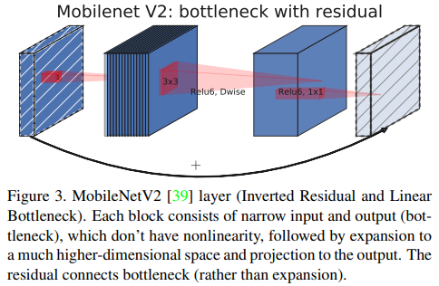
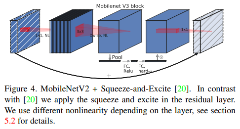
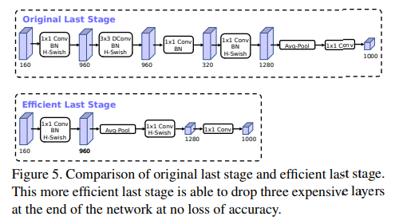
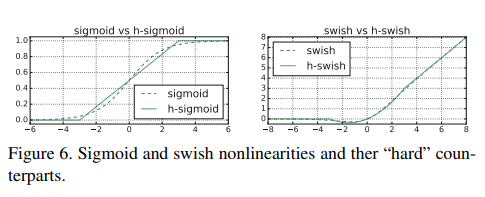
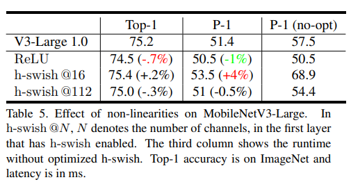
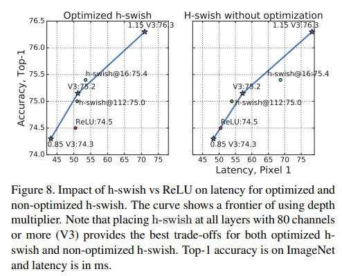
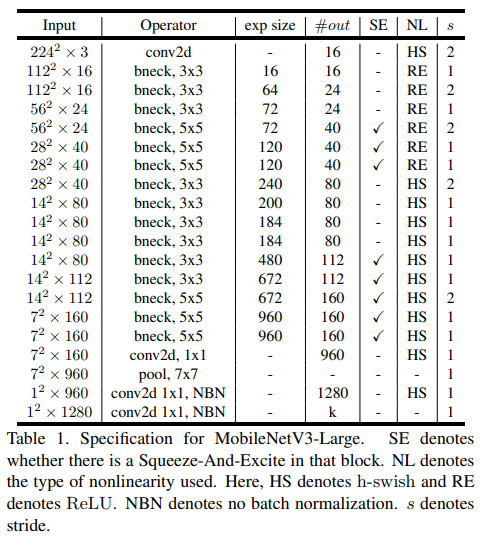
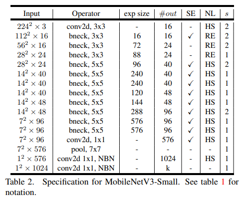

# [MobileNet V3](https://arxiv.org/abs/1905.02244)
본 페이지에서는 MobileNet V3의 등장배경과 특징에 대해서 말하고자 합니다.

---

## 1. MobileNet V3

효율적인 네트워크는 최근 들어 많이 연구되고 있는 분야이다.

기존에는 Deep learning 서비스를 사용하려면 많은 연산량을 필요해서 개인적인 컴퓨터에서 사용하기 어려워 서버로 데이터를 전송해 서버에서 처리 후에 결과를 사용자에게 보내주는 방식으로 서비스를 제공 받았다.

이러한 방식의 문제점은 개인의 데이터가 서버로 가서 개인정보를 서버측에서 가지게 되어 개인정보 유출의 문제가 있었는데 모델이 경량화 됨에따라 이런 과정 필요없이 바로 사용자 측의 기기에서 사용할 수 있게 되었다.

본 논문의 특징은 다음과 같다.

    - MobileNet을 기반으로 combination of complementary search techniques를 이용해 모델의 구조를 디자인하였다.

    - 또한 Classification 구조만을 변경한 것이 아닌 Segmentation 작업에서 decoder 부분을 새롭게 제안하였다.(여기선 다루지 않습니다.)

    - 새로운 구조와 함수들을 통해 MobileNet V3를 구현하였다.

    - MobileNet V3를 특정 상황에 따라 선택하도록 small, large 버전으로 만들었다.

## 2. Efficient Mobile Building Blocks

이 부분에서는 MobileNet V3를 만들면서 다른 효율적인 모델들에서 어떤 점을 참고 했는지 보여줍니다.

---

### MobileNet V1

---

본 논문에서 제안한 모델의 이름이 MobileNet V3인 것처럼 기존의 MobileNet의 주요한 특징인 Depthwise Separable Conv 연산을 사용하였습니다.

이 방식은 간단하게 말하면 기존의 3x3 Conv 연산을 3x3 Depthwise Conv 연산과 1x1 Pointwise Conv 연산으로 분리하여 연산을 하였고 이는 기존의 3x3 Conv 연산보다 효율적인 연산이 되었습니다.

더 자세한 설명은 MobileNet V1을 설명한 자료를 보시면 됩니다.

---

### MobileNet V2

---

MobileNet V1의 Depthwise Separable Conv 연산과 Residual block을 결합하면서 동시에 비선형 변환의 정보 손실을 고려하여 Inverted Residual block을 만들어서 성능과 메모리,지연시간을 모두 고려한 모델입니다.

---

### MnasNet

---

MnasNet은 MobileNet V2구조를 기반으로 SE(squeeze and excitation) block을 기존의 SE-ResNet과는 다르게 bottleneck 구조에 넣어 lightweight attention module을 만들어 냈습니다.

---

### MobileNet V3

---

최종적으로 위의 모델들을 참고해 MobileNet V3 모델을 만들었고 구조는 아래와 같습니다.

비선형 함수로 swish 함수를 사용하였습니다.

이때 SEBlock과 swish 비선형 함수 모두 sigmoid 함수를 사용하는데 이는 연산에서 비효율일 뿐 아니라  고정 소수점을 사용하는 곳에서 정확도 유지하기 어렵기 땜누에 이러한 simgoid 함수를 hard sigmoid로 대체합니다.

## 3. Network Search

Network Search 자체는 네트워크 구조를 찾아내고 최적화 하는데 매우 강력한 도구이다.

MobileNet V3에서 platform-aware NAS와 NetAdapt를 사용했는데 각 기능은 다음과 같다.

    - platform-aware NAS : 네트워크 각각의 block을 최적화 하면서 네트워크의 전체적인 구조를 탐색한다.

    - NetAdapt : 각 layer별 filter들의 수를 탐색하는 알고리즘이다.

이러한 기술들은 보완적이며 주어진 hardware platfomr에서 최적화 되고 효율적인 모델을 찾을 수 있다.

### 3.1 Platform-Aware Nas for Block-wise Search

MnasNet 논문과 비슷하게 platform-aware NAS 방법을 전체적인 네트워크 구조를 찾기 위해 사용하였다.

특히 같은 RNN 기반의 controller와 같은 계층적 탐색 공간을 사용하기 때문에 대략 80ms 목표 지연시간을 위해 목표로 하는 large mobile model과 같은 비슷한 결과를 냈다.

그러므로 MnasNet-A1을 초기 모델로 사용하고 이후 NetAdapt를 를 적용한다.

그러나 Small mobile model에서는 기존에 사용하던 reward design이 적합하지 않았다.

기존에 사용하던 reward desing은 아래와 같다.

$$ 
ACC(m) \times [ LAT(m) / TAR ]^w
$$

ACC(m)은 모델의 정확도 LAT(m)은 model의 지연시간 TAR은 목표 지연시간이다. 기존의 w값은 -0.07이다.

작은 모델에서는 정확도가 훨씬 더 많이 변하게 되었고 이 때문에 w를 -0.15로 더 낮추었습니다.

이렇게 해서 이후에 NetAdapt를 적용해 MobileNet V3-Small 모델을 찾아냈다.

### 3.2 NetAdapt for Layer-wise Search

이 방법은 이전의 방법과 보완적인 방법인데 순차적인 상황에서 개별 레이어들을 fine tuning하게 해주는 것이다. 

이 방법은 다음과 같은 순서로 진행 된다

    1. platform-aware NAS 기법으로 찾아낸 모델로 시작한다.

    2. 각 step에 대해서

        (a) 새로운 proposal들의 집합을 만들고 각각의 proposal은 이전 step과에 비해서 최소 δ만큼의 지연시간 감소를 만들어내는 modification of an architecture를 나타낸다.

        (b) 각각의 proposal에서 이전 step의 pre-trained된 모델을 사용하고 새로운 proposed architecture를 채운다. 이때 기존의 것을 자르고 사라진 가중치에 대해서는 적절하게 무작위로 초기화한다. 이후 각각의 proposal을 T step동안 coarse estimate of accuracy를 얻기 위해 Finetune한다.

        (c) 어떠한 평가 지표에 따라서 최고의 proposal을 찾는다.
    
    3. 목표 지연시간에 도달할 때까지 2번을 반복한다.

MnasNet에서 평가 지표는 정확도의 변화를 최소화 하는 것이 목표였다.

본 논문은 이러한 알고리즘을 수정하고 지연시간의 변화와 정확도의 변화 사이의 비율을 최소화 하는 것으로 하였다.

즉 NetAdapt step마다 생성된 모든 proposal들에서 , 다음을 최대화 하는 것을 선택한다.(이때 ∆latency는 2(a)를 만족한다.)

$$
\frac{∆Acc}{|∆latency|}
$$

본 논문이 사용하는 proposal들이 이산적이기 때문에,trade-off 곡선의 slope를 최대화 하는 proposal들을 선호한다.

또한 proposal들은 MnasNet에서 사용한 것과 동일하다.

특히 아래 두개의 proposal을 사용했다.

    1. Expansion 레이어의 사이즈를 줄인다.

    2. residual connection을 유지하기 위해서 같은 bottleneck size를 가지고 있는 모든 블럭에 있는 bottleneck을 줄인다.

실험에서는 T=10000을 사용했고 δ = 0.01|L| 을 사용했다.

## 4. Network Improvement

이 부분에서는 다음을 설명합니다.

    - 네트워크의 시작과 끝에 있는 computaitionally expensive 한 레이어를 수정하는 과정

    - 새로운 비선형 함수 인 h-swish함수(더 빠르고 더 양자 친화적입니다.)

### 4.1 Redesigning Expensive Layers

이전 과정에서 찾아낸 모델의 구조에서 첫 부분과 마지막 레이어는 다른 것들에 비해 computationnally expensive 하였다.

---

### Move last layer 

---

MobileNet V2의 최종 1x1 conv 레이어는 고차원의 feature 공간으로 확장하는 것인데 이는 예측에서 매우 중요하지만 추가적인 지연시간을 발생시키낟.

이러한 지연시간을 감소시키기 위해서 이 레이어를 최종 average pooling 뒤로 옮기는 것이다.

이렇게 될 경우 7x7의 해상도 대신 1x1 해상도로 conv연산을 진행하게 되어 지연시간을 줄이게 된다.

또한 이렇게 레이어를 이동시킬 경우 그 이전 레이어에서(Inverted residual block)에서 bottleneck 레이어는 필요 없어지게 되고 이를 삭제함으로써 computational complexity도 줄이게된다.

아래의 그림을 보면 이해할 수 있다.

특히 이러한 변화는 정확도의 변화 없이 7ms의 지연시간을 감소 시키고 이는 실행시간의 11%에 해당한다. Ehgks 3000만개의 연산을 줄인다.

---

### Initial set of filters

---

MobileNet은 모델의 시작부분에서 3x3 Conv를 통해 32개의 채널로 만들어지는데, 이러한 채널들은 중복된 채널들이 발생하는 경우가 있다.

이를 채널의 수를 16으로 줄임과 동시에 다른 비선형 변환(hswish)을 이용해 중복을 줄이려고 하였다.

이를 통해 2ms를 줄이며 1000만개의 연산을 줄였다.

### 4.2 Nonlinearities

swish 라는 함수는 ReLU를 사용할 때보다 성능에서 상당한 향상을 발견할 수 있다. 이때 식은 다음과 같다.

$$
Swish(x) = x * sigmoid(x)
$$

하지만 이러한 비선형 변환이 정확도를 올려준다고 해도 sigmoid의 특성상 연산량이 증가하게 된다.

이러한 문제를 해결하기 위해 두가지 방법을 사용했다.

---

### Replace Swish to H-Swish

---

기존의 sigmoid 함수를 대체하기 위해서 H-ReLU6라는 함수를 만들었다.

H-ReLU6 함수의 식은 다음과 같다.

$$
H-ReLU6(x) = \frac{ReLU6(x+3)}{6}
$$

이를 Sigmoid에 대체해 H-Swish 함수를 만들었고 식은 다음과 같다.

$$
H-Swish = x * H-ReLU(6) = x * \frac{ReLU6(x+3)}{6}
$$

이러한 H-Swish은 성능에는 큰 차이는 없지만 다음과 같은 장점이 있다.

    1. ReLU6는 모든 소프트웨어와 하드웨어 프레임워크에서 사용이 가능하다.

    2. 양자화 모드에서 H-Swish는 sigmoid와 비슷한 다른 구현에 의해서 발생하는 정확도의 손실이 없다.

    3. 실제로 사용할 때 지연시간을 증가시키는 메모리 접근의 수를 줄인다.

---

### Nonlinearity cose

---

비선형 변환 함수를 적용할 때 발생하는 cost는 네트워크가 깊어지면서 줄어들게 된다.

그 이유는 해상도가 절반으로 줄어들기 때문에 그에 대한 cost도 줄어드렉 되는 것이다.

기존의 swish를 사용하면서 발생하는 장점은 swish를 깊은 레이어에서(나중에) 사용할 때 발생하는 것을 알게되었고 이에 따라 네트워크를 절반으로 나눈 후 뒷 부분에 h-swish를 사용하였다. 

이는 [4.4](#44-mobilenetv3-definition)에 있는 table1,table2에서 확인할 수 있다.

비록 H-Swish가 여전히 지연시간을 발생시킨다고 해도 기존의 모델들보다 최종적인 지연시간은 더 낮다.

### 4.3 Large Squeeze and Excite

SE blokc의 크기는 bottleneck의 크기와 연관되어 있는데 이러한 크기를 expansion 레이어의 채널의 1/4로 고정하였다.

이렇게 하는 것이 정확도를 향상시키고 지연시간을 크게 증가시키지 않는다.

### 4.4 MobileNetV3 Definition

MobileNetV3는 Large,Small 버젼들이 있는데 이러한 모델들은 resource의 사용량에 따라 다르다.

---