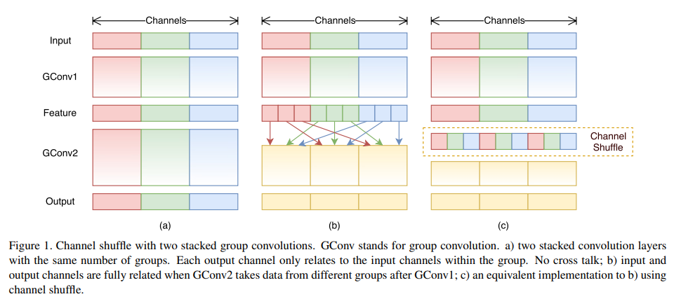
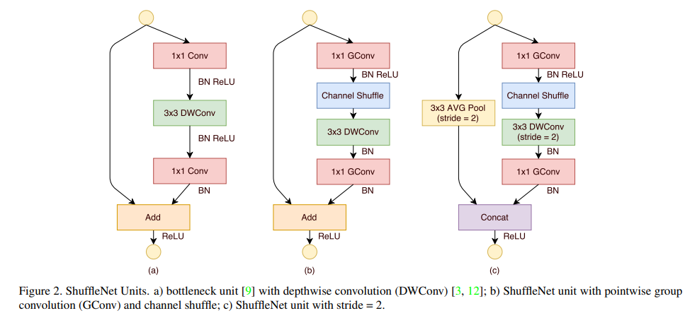
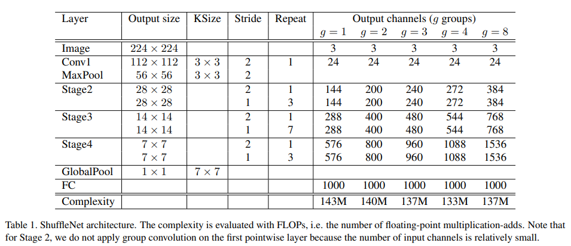

# [ShuffletNet](https://arxiv.org/abs/1707.01083)
본 페이지에서는 ShuffletNet의 등장배경과 특징에 대해서 말하고자 합니다.

---
## 1. ShuffleNet 특징

ShuffleNet은 모바일 디바이스를 위해 디자인 되었으며 매우 작은 computing power에서도 잘 작동한다(10~150 MFLOPs)

ShuffletNet의 주요한 특징은 두개의 새로운 연산으로 구성되는데 pointwise group convolution과 channel shuffle로 이루어져있다.

40 MFLOPs 아래의 computation 예산에서 MobileNet보다 성능이 좋았다.

ARM based 모바일 디바이스에서 ShuffleNet은 정확성을 유지하며 AlexNet을 넘어 13배 빠른 속도를 냈다.

기존에 있던 모델들을 줄이는 방법은 pruning,압축,low-bit 방법을 사용해서 줄였다.

Xception과 ResNeXt와 같은 SOTA모델들은 dense 1x1 conv를 사용하기 때문에 극도로 작은 network에서 덜 효율적으로 된다.

본 논문에서는 pointwise group conv연산을 통해 기존 1x1 conv의 computation의 복잡성을 줄이기 위해 사용한다.

Group conv를 사용하면서 발생하는 side effect를 극복하기 위해 본 논문에서는 channel shuffle operation을 feature channel을 통해 정보가 흐르는 것을 돕기 위해 사용하였다.

제한된 computation 복잡성에서 ShuffleNet은 더 많은 feature map 채널을 가질 수 있게 되어 더 많은 정보를 encode할 수 있게 되었다.
(원래라면 더 많은 feature map 채널을 갖는 것은 매우 작은 network의 성능에서는 치명적이다.)

## 2. Convolution
기존의 SOTA 모델 (Xception과 ResNeXt)는 효율적인 depthwise separable conv 또는 group conv를 제안했지만. 두 디자인 모두 1x1 conv와 같지 않다(또한 pointwise conv에도 속하지 않는다.)

ResNeXt는 3x3layer는 group conv와 함께 하였고, 그 결과 각각의 Residual unit에서 pointwise conv가 93.4%의 muliplication-add를 차지한다.

작은 네트워크에서는,expensive한 point wise conv는 제한된 복잡성에 충족하기 위해 채널의 수를 제한한다. 이 결과가 정확성에 영향을 준다.

### 2.1 Channel Shuffle for Group Convolutions

#### 2.1.1 Pointwise Group Convolution(문제)

기존의 문제를 해결하기 위해서 직접적인 해결법은 Channel Sparse Connection을 연결하는 것이다.

예를 들어 group conv(또한 또는 pointwise conv)와 같이,각각의 conv 연산은 입력에서 오직 하나의 channel group과 상호 반응한다고 한다면,group conv는 충분히 computation cost를 줄이긴 하지만 다른 문제들이 있다.

입력 채널의 특정 그룹으로부터 발생된 출력은 결국 입력 채널의 작은 일부분을 통해 결과를 얻어낸다는 것이다. [Fig1(a) 두개의 group conv layer가 쌓인 상황을 보여준다.]

특정 그룹으로부터 의 출력은 해당 그룹의 입력과 관계가 있다는 것은 명확하지만. 이러한 특성은 채널에서 그룹과 그룹사이의 정보의 흐름을 방해하고 representation을 약하게한다.

#### 2.1.2 Pointwise Group Convolution(해결방안)
만약 group conv가 다른 그룹으로부터 입력 데이터를 얻을 수 있다면 입력과 출력은 충분히 관계가 생긴다.[Fig1(b)]

특히,이전 group layer로부터 만들어진 feature map에서,각각의 그룹에서의 채널을 몇몇개의 sub group으로 나눌 수 있다.

그런 후 각각의 그룹을 다른 subgroup들과 함께  다음 레이어의  입력으로 사용한다.

#### 2.1.3 Channel Shuffle

이러한 점들은 Channel Shuffle 연산으로구현될 수 있다.[Fig1(c)]

Conv layer의 g개의 group들로 하여 최종적으로 g*n개의 채널을 출력한다고 가정한다.

우리는 처음에 출력 채널의 dimension을 기존에는(g*n) 이었던 것을 (g,n)으로 재구성한다.(w,h,c)->(w,h,g,n) -> (w,h,n,g) -> (w,h,c)

channel shuffle 연산은 다중 group conv 레어와 함께 더 강력한 구조를 만들 수 있게 할 수 있다.

## 3. ShuffleNet Unit

### 3.1 ShuffleNet Unit(Stride 1)

처음에 Fig2(a)처럼 bottleneck unit을 만들었고 이는 residual block이다.

이러한 residual block에서 3x3 layer를 3x3 depthwise conv로 대체하고 첫번째 1x1 layer를 pointwise group conv로 대체하고 이후에 channel shuffle 연산을 하도록 하였다.[fig2(b)]

이때 첫번째 1x1 gconv는 bottleneck 역할을하며 채널 수를 1/4로 줄인다.

second pointwise group conv의 목적은 줄어들었던 channel dimension을 shortcut path와 match 하기 위해 복구하는 것이다.

추가적인 channel shuffle 연산을 두번째 pointwise 연산 이후에 적용할 필요 없다는 것이다.(넣는다고 해도 큰 결과차이는 얻기 힘듦)

첫번째 pointwise conv에 뒤에는 BN과 ReLU를 적용하고 나머지 연산에서는 BN만 적용한다.

### 3.2 ShuffleNet Unit(Stride 2)
sufflenet에서 stride와 함께 적용한다면 기존의 Unit에 두가지 수정을 한다.[fig2(c)]

1.shortcut path에 3x3 average pooing을 추가한다.

2. element wise addition을 channel concatenation으로 대체한다,이것은 enlarge channel dimension을 적은 추가적인 computation cost를 갖게 하도록 한다.

### 3.3 FLOPs
주어진 입력 크기 (c,h,w)에 대하여 bottlenck 채널들 m에 대하여 ResNet은 hw(2cm+9m^2) FLOPs을 요구하고 ResNeXt는 hw(2cm+9m^2/g)FLOPs를 요구하고 Shufflenet은 hw(2cm/g+gm) FLOPs를 가진다.

이때 g는 conv연산에서의 group의 수를 말한다.

주어진 computational budget에서  shufflenet은 더 넒은 feature map을 사용할 수 있다는 것이다.

### 3.4 Depthwise Convolution

shufflenet 에서 depthwise conv연산은 bottleneck feature map에서만 수행되어진다.

depthwise conv가 이론적으로 덜 복잡하다고 하여도, 저전력 모바일 디바이스에서 효율적으로 depthwise conv를 구현한다는 것은 어렵다.

이유는 아마 다른 dense operation과 비교하였을때 나쁜 computation memory access ratio로부터의 결과라고 본다.

shufflenet unit들에서,우리는 depthwise conv를 가능한 overhead를 방지하기위해 bottleneck에서만 사용하였다.

## 4. Networ Architecture

3개의 Stage로 ShuffleNet Unit Group을 구성했다.

Building block에서의 각각의 스테이지의 첫번째 unit에서는 stride=2를 사용한다 나머지 하이퍼 파라미터는 동일하다

다음 스테이지의 출력 채널의 수는 이전 스테이지의 출력 채널의 수의 두배가 된다.

각각의 shufflenet unit의 bottleneck 채널의 수는 출력 채널의 ¼로 한다.

### 4.1 Scale Factor
네트워크를 요구된 복잡성에 따라 customize하기 위해 scale factor s를 채널의 수에다가 적용한다.

예를들어 table1에서 shufflenet 1x 와 같이 shufflenet sx라고 한다.

그러므로 전반적인 복잡성은 shufflenet 1x의 s^2배가 된다.

각각의 출력 채널 값xs를 하면 된다.

---