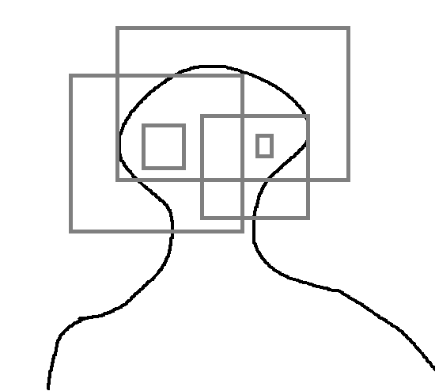

# [YOLO](https://arxiv.org/abs/1506.02640)
본 페이지에서는 YOLO의 등장배경과 특징에 대해서 말하고자 합니다.

IoU와 Non Maximal Suppresion에 대해 잘 모르시는 분은 먼저 아래를 눌러 IoU와 Non Maximal Suppresion에 대해서 보고 와주세요

1. [IoU(Intersection over Union)](#51-iouintersection-over-union)

2. [Non Maximal Suppresion](#52-non-maximal-suppresion)

---

## 1. 기존의 모델들
기존의 Object Detection 방식들은 classifier를 detection 모듈로 재구성 해서 객체를 탐지했다.

대표적으로 DPM또는 R-CNN등이 있는데 특징은 다음과 같다.

- DPM은 전체 이미지에 대해서 Sliding window 방식을 사용해서 classifier를 사용하도록 한다.

- R-CNN은 먼저 Bounding box를 만들고 해당 bounding box에 대해서 classifier를 적용하는 방식이다.

이후에 후처리를 통해 중복된 bounding box와 같은 필요 없는 것을 제거하거나 다른 객체를 기반으로 box를 rescore하는 방식들이다.

이러한 구조 때문에 처리하는 속도가 느려지게 되고 각각에 요소에 대해서 학습하는 것이 어려워진다.

즉, Object detection을 두 단계로 처리해서 이를 Two-stage detection이라고 한다.

## 2. YOLO

YOLO는 이와 다르게 Bounding box와 class에 대한 확률을 회귀 문제로 본다.

이 방법은 Bounding box와 class에 대한 확률을 한번에 예측할 수 있게 한다.

이러한 구조 때문에 초당 45장 최대 155장의 이미지를 처리해 realtime detection이 가능하게 한다.

또한 기존의 realtime으로 객체 탐지가 가능한 SOTA모델들에 비해 더욱 더 정확한 예측을 할 수 있다.

YOLO의 구조는 간단하게 다음과 같이 보여줄 수 있다.

이러한 YOLO의 장점은 세가지가 있다.

 1. YOLO는 매우 빠르고 객체 탐지를 회귀 문제로 해결해 복잡한 파이프라인이 필요없다.

    이로 인해 느리면 초당 45장의 이미지를 처리할 수 있고 빠르면 초당 150장의 이미지를 처리할 수 있다.

 2. YOLO는 예측을 할 때 이미지의 전체적인 부분에 대해서 근거를 둔다.

    sliding window 방식이나 일부분의 지역을 보는 기술과는 다르게 이미지의 전체적인 부분에 대해서 학습하기 때문에 context정보를 더 잘 얻는다.

 3. YOLO는 객체의 generalizable representation에 대해 학습한다.

    높은 generalize 때문에 새로운 상황이나 예측하지 못한 입력에 대해서도 높은 성능을 보인다.

## 2.1 Object detection Method

각각의 Bounding box를 예측하기 위해 전체이미지로부터 feature들을 얻어내 사용했고 이 때문에 Bounding box에 대해서 Class를 예측할 수 있게 되면서 한번에 Class와 Bounding box에 대해서 예측할 수 있게 되었다.

그 방법은 다음과 같다.

1. 입력 이미지를 모델을 통해서 SxS의 격자 cell들로 변환한다.

2. 객체의 중심좌표가 격자 cell 내부에 있다면 그 격자 cell은 객체를 탐지한 것이다.

3. 각각의 격자 Cell은 B개의 Bounding box 정보와 C개의 class별 확률로 이루어져있다.

### Bounding box
- 각각의 bounding box는 (x,y,w,h,confidence) 5개의 값을 가진다.

- x,y는 해당 "격자 cell의 경계"로부터의 상대적인 좌표이다.

- w,h는 "전체 이미지"로부터의 상대적인 너비와 높이이다.

### Confidence Score

$$
Pr(Obj) \times IoU(pred,true)
$$

- Confidence Score는 해당박스가 어떠한 객체를 포함하고 있는지에 대한 Confidence이고 모델이 예측한 박스가 얼마나 정확한지를 나타낸다.

- Cell내에 어떠한 객체도 없다면 Confidence score는 0이다.

- Confidence Score는 해당 cell에 대한 Ground truth box와 Cell 내의 어떤 Bounding box의 iou 값과 동일하다고 볼 수 있다.

- IoU에 대한 자세한 설명은 [여기](#51-iouintersection-over-union) 있습니다.
### Class probablity

$$
Pr(Classi|Obj)
$$

- 각각의 격자 cell은 C개의 클래스에 대한 확률 집합으로 구성되어 있다.

- 한개의 격자 cell당 하나의 클래스만을 예측한다.

### Class specific confidence score

- 식(1)은 각 Bounding box에 대한 특정 클래스에 대해서 Confidence score를 제공한다.

- 위 식은 box에 나타난 클래스에 대한 확률과 박스가 얼마나 객체에 맞게 예측이 되었는지를 나타낸다.

### Shape

본 논문에서는 Pascal VOC(20개의 클래스를 가짐)를 평가하기 위해

S=7 B=2 C=20을 사용해서 7x7x30 tensor를 가지게 되었다.

이때 출력의 모양은 SxSx(B*5+c) 이다.

이때 채널수가 B*5+C인 이유는 한개의 박스마다(x,y,w,h,confidence)를 갖고 하나의 격자 cell마다 C개의 클래스 확률을 갖기 때문이다.(격자당 하나의 Class만 예측하기때문이다.)

이때 하나의 격자당 최대 두개의 box만을 예측할 수 있기 때문에 하나의 이미지 내에서 7x7x2(98)개의 bounding box만을 예측할 수 있는 것이다.

## 3. Network

## 3.1 Detail

본 논문의 구조는 GoogLeNet모델에 영향을 받았는데

이때 Inception module을 사용하는 것 대신에 1x1 reduction layer -> 3x3 conv layer를 사용한다.

그 구조는 아래 그림과 같다.

YOLO는 모델은 다음과 같이 두 모델로 나뉜다.

- Normal YOLO : 24개의 Conv layer를 지난후 2개의 FC Layer와 연결된다.

- Fast YOLO : 9개의 Conv layer를 지난후 2개의 FC Layer와 연결된다.

모델의 크기는 다르지만 , 두 모델의 파라미터 수는 같다.

이때 입력 이미지는 fine grained된 특징을 더 잘 얻기 위해 224x224의 해상도를 448x448로 바꾸었다.

추가적으로 최종 활성함수를 제외한 나머지 함수를 Leaky ReLU함수를 사용하였고 Leaky ReLU 식은 아래와 같다. 

## 3.2 Regression

YOLO 모델은 기존 모델들과 다르게 회귀문제로 Detection을 해내는데 이를 위해서 sum squared error를 optimize하는 방식을 사용한다.

이때 학습하기에는 더 쉬워지나, YOLO에 바로 쓰기에는 애매해진다.

그 이유는 다음과 같다.

1. Localization error(box에 대한 정보)를 Classification error(확률 분포)와 동일하게 가중치를 두는데 이는 이상적이지 않다(본 논문에서는 한 격자당 30개의 채널이 있는데 그냥 MSE를 적용하는 경우 20개의 class,2개의 bounding box 정보 라고 보는 게 아니라 30개의 class에 대한 것이라고 판단할 수 있음)

2. 이미지에서 격자 cell들은 어떤 객체도 포함하지 않는 경우가 많은데 이러한 이유 때문에 confidence score가 0으로 향하게 학습이 된다.(이러한 점이 각각의 객체를 포함한 cell들의 gradient를 압도하는 경우가 생김[없다고 판단하게 만든다는 의미])

이를 해결하기 위해서 bounding box Localization loss를 증가시키고 객체를 포함하지 않은 박스들에 대한 confidence를 낮추기 위해 다음과 같은 파라미터를 정의했다.

λcoord = 5로 두고 λnoobj = 0.5로 설정했다.

또한 Sum-squared error는 큰 box와 작은 box에서의 error 또한 동등하게 가중치를 두는데

이때 YOLO의 error metric은 큰 box에서의 작은 편차가 작은 box에서보다 덜 중요하다는 것을 반영을 해야한다.

이를 어느정도 해결하기 위해서 bounding box의 너비와 폭에 square root를 적용한다.

## 3.3 Responsible
각 격자 cell에는 여러가지 bounding box가 있다.(본 논문에서는 2개의 bounding box가 존재함)

이때 각 객체에 대해 하나의 bounding box predictor만을 원하는데(즉 여러개의 박스 예측 중에서 하나만 나오게 하고 싶어하는 것을 의미함)

이때 Responsible 이라는 것은 하나의 cell에 대한 bounding box들과 ground truth와의 IoU가 가장 높은 예측을 말한다.

## 3.4 Loss Function

이때 식에서 1(obj,i)는 cell i에서 객체가 있음을 의미하고 1(obj,(i,j))는 i번째 cell에서 j번째 bounding box가 해당 예측에 대한 "responsible"을 의미한다..

객체가 있다고 판별하는 경우에 대해서 loss를 구할때는 responsible 정보만을 사용하면 되지만

객체가 없다고 판별하는 경우에는 모든 bounding box의 정보를 사용해서 loss를 구해야한다.

위 식에서 각각의 줄은 다음을 의미한다
1. Bounding box의 중심좌표 차이에 대한 Loss (localization)[Reponsible]
2. Bounding box의 크기 높이 차이에 대한 Loss (localization)[Reponsible]
3. 객체가 있는 경우의 Confidence Score 차이에 대한 Loss(confidence)[Reponsible]
4. 객체가 없는 경우의 Confidence Score 차이에 대한 Loss(confidence)[All]
5. 각 클래스 값 차이에 대한 Loss(classification)

## 3.5 Non Maximal Suppression
Object detection의 결과를 확인할 떄 하나의 객체에 대해서 하나의 Bounding box만을 예측해야하지만 실제 결과에서는 하나의 객체에 여러개의 Bounding box가 존재할 가능성이 높다.

[Fig2](3)를 보더라도 하나의 객체 주변에 대해 많은 bounding box가 존재한다.

이는 Non Maximal Suppresion을 통해 해결할 수 있다.

Non Maximal Suppression에 대한 설명은 [아래](#52-non-maximal-suppresion)에 있습니다.

## 4. YOLO의 한계

1. 하나의 이미지에 탐지될 객체의 수의 제한
    앞에서 말했듯이 출력의 모양은 SxSx(B*5+c) 이라고 할때 한 셀당 bounding box에 대한 정보는 B개가 존재 하므로 한 이미지당 SxSxB개의 bounding box만 탐지할 수 있다.

2. coarse feature의 사용
    본 논문의 YOLO 모델은 bounding box를 예측하기 위해 상대적으로 coarse feature를 사용하는데 이 이유는 입력이미지에 대해서 많은 downsampling layer를 가지기 때문이다.

3. 큰 box와 작은 box에 따라 다른 IoU값 변화에 따른 loss에서의 영향

    예를들어 4x4의 이미지 2x2 이미지 각각에서 의 한 픽셀 차이로 인한 IoU 값은 15/16이고 3/4로 작은 이미지에서의 IoU값 차이가 커지기 때문이다.

## 5. Others

## 5.1 IoU(Intersection over Union)

IoU란 합집합에 대한 교집합의 비율이라고 보면 되는데 YOLO에서와 같이 두 박스에대한 IoU는 위의 그림과 같다고 보면 된다.

이때 두 박스가 거의 일치할 수록 교집합 부분이 많아져 IoU값이 높아진다.

IoU가 높을수록 두 박스가 일치하는 부분이 많다고 볼 수도 있다는 것이다.

Box A와 B의 중심좌표와 너비 높이를 아래와 같이 정의하면 아래와 같다.(x,y,w,h)

A = (Xa,Ya,Wa,Ha)
B = (Xb,Yb,Wb,Hb)

이 정보를 통해 박스위 왼쪽위 좌표(x1,y1) 오른쪽 아래 좌표(x2,y2) 로 변환하면 다음과 같다.(x1,y1,x2,y2)

A = (Xa-Wa/2,Ya-Ha/2,Xa+Wa/2,Ya+Ha/2) = (X1a,Y1a,X2a,Y2a)
B = (Xb-Wb/2,Yb-Hb/2,Xb+Wb/2,Yb+Hb/2) = (X1b,Y1b,X2b,Y2b)

이때 겹치는 부분의 왼쪽 위 좌표 오른쪽 아래 좌표는 다음과 같다.

I = (max(x1a,x1b),max(y1a,y1b),min(x2a,x2b),min(y2a,y2b)) = (X1i,Y1i,X2i,Y2i)

합집합과 교집합 사이의 관계는 다음과 같다.

$$
Union(A,B) = A + B - Intersection(A,B)
$$

만약 두 박스가 겹친다고 할 때 Intersection(A,B)는 다음과 같다.

$$
Intersection(A,B) = (X2i-X1i) \times (Y2i-Y1i)
$$

이때 A와 B는 각각 다음과 같으므로

$$
A = (X2a-X1a) \times (Y2a-Y1a)
$$

$$
B = (X2b-X1b) \times (Y2b-Y1b)
$$

이를 이용해 IoU 를 수식으로 표현하면 다음과 같다.

$$
IoU = \frac{(X2i-X1i) \times (Y2i-Y1i)} {(X2a-X1a) \times (Y2a-Y1a) + (X2b-X1b) \times (Y2b-Y1b) - (X2i-X1i) \times (Y2i-Y1i)}
$$

## 5.2 Non Maximal Suppresion

Object Detection을 수행한 결과를 확인해보면 아래의 그림처럼 하나의 객체에 대해서 여러가지의 Bounding box가 나올 수 있다.

이러한 여러 Bounding box 중에서 객체를 잘 보여주는 Box를 제외한 나머지 박스를 제외시켜주는 것이 NMS라고 할 수 있다.

NMS알고리즘은 다음과 같다.
입력(I) : Bounding box들,Confidence threshold,IoU threshold
출력(O) : 선택된 box들

1. I에서 Bounding box별로 Confidence threshold 이하의 Box는 제거한다.

2. 가장 높은 confidence score를 가진 Bounding box 순으로 오름차순 정렬한다.

3. 특정 이때 가장 높은 confidence score를 가진 bounding box를 I에서 O로 옮긴다.(I에 더이상 box가 없으면 종료)

4. 3에서 선택한 box와 겹치는 box를 모두 조사하여 두 box에 대한 IoU threshold 이상인 boundong box를 I 에서 모두 제거한 후 3.으로 간다.