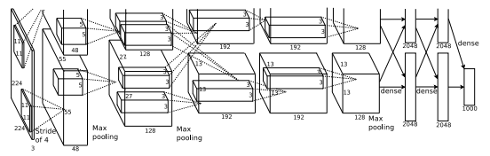
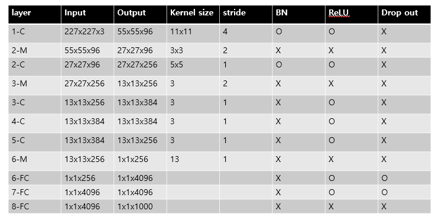

# [AlexNet](https://proceedings.neurips.cc/paper/2012/file/c399862d3b9d6b76c8436e924a68c45b-Paper.pdf)
본 페이지에서는 AlexNet의 등장배경과 특징에 대해서 말하고자 합니다.

---
## 1. AlexNet 특징
AlexNet은 기존의 논문들과는 다르게 학습 속도를 빠르게 하면서 Overfitting을 방지 하고자 하였다.

그 방법들은 아래와 같다.

- 기존의 활성함수와는 다르게 ReLU라는 활성 함수를 사용해 비선형 변환을 사용하였다.
- 빠르게 학습 하기 위해서 GPU를 활용하였다.
- Local response normalization 를 사용하여 성능을 개선하며 generalize를 실현했다.
- FC Layer(Fully Connected Layer)에 Drop out 메소드를 사용하였다.

---
## 2. 변화

## 2.1 ReLU 활성함수
ReLU 함수의 식은 다음과 같다.

$$
f(x)=Max(0,x)
$$

이러한 ReLU함수의 특징은 식이 매우 간단하다는 것이다.

기존의 tanh,sigmoid 같은 활성 함수는 gradient descent를 사용해 학습하는 동안 연산의 처리가 오래 걸렸었다.

이러한 단점을 개선 할 수 있는 비선형 변환이 가능하게 하는 함수로 ReLU라는 함수를 도입해 몇배 더 빠르게 학습이 가능해졌다.

## 2.2 여러개의 GPU 활용
하나의 GPU 메모리로는 학습하는 과정에서 메모리의 제한이 발생할 수 있다.

이러한 문제를 해결하기 위해 GPU를 병렬로 설치 하였고 각 GPU에 연산을 나누어 처리 하고 결과를 분리하거나 합치는 연산을 하여 학습을 진행한다.

## 2.3 Local response normalization
ReLU만으로도 충분한 학습이 되기도 하고 정규화가 필요 하지 않지만  추가적인 성능 향상을 위한 방법이 필요하다

local normalization을 통해 generalization을 더욱 더 확실히 할 수 있게 하려고한다.

본 논문에서는 이 방법을 사용하였지만 이를 구현하지는 않았습니다.

## 2.4 Overlapping pooling
기존의 Pooling layer들은 Pooling을 하며 지나갈 때 겹치는 부분 없이 연산을 진행 했다.

pooling layer의 ZxZ 사이즈의 filter의 중간 좌표로 부터 s 픽셀만큼 떨어진 위치로 필터의 중간 지점을 옮기다고 할 때

S=Z라고 한다면 기존의 CNN에서 흔하게 사용되는 Pooling 연산과 다를게 없다.

하지만 S<Z일 때 filter가 겹치게 되면서 Pooling 연산을 진행하게 된다.

논문에서는 S=2,Z=3으로 하여 실험을 진행했고 결과가 더 좋고 overfitting이 덜 일어났다.

## 2.5 drop out
학습을 하면서 특정 feature에 대해서 과한 학습이 이루어져 다른 feature에 대해 제대로 학습 되지 못하는 경우가 발생한다.

이러한 경우 overfitting으로 이어질 수 있다.

이를 방지하기 위해 무작위로 특정 feature를 비활성화 시켜 다른 feature들에 대해서 잘 학습 되도록 한다.

본 논문에서는 Dropout 비율을 0.5로 하여 처음 두개의 FC Layer에 적용했다.

---

## 3. AlexNet 구조

AlexNet의 구조는 총 8개의 layer로 이루어져 있으며 1~5번째 layer는 Convolution Layer이며 나머지 3개는 Fully Connecter Layer이다.

논문에서는 입력 이미지의 크기는 224x224x3이라고 하지만 이는 잘못 입력한 것이고 실제로 사이즈는 227x227x3 이라고 한다.

또한 두 GPU를 사용해 병렬 연결하여 학습을 시킨다고 했지만 현재 GPU의 성능은 충분한 메모리를 가지고 있어 구현은 다르게 하였다.

## 3.1 구조 특징

- 마지막 FC Layer는 1000개의 class에 대한 classification을 하기 위한 layer로 softmax 함수를 적용한다.
- Max pooling layer는 첫 번째 레이어와 두 번째 레이어 뒤에 적용되며 또한 다섯 번째 레이어 뒤에도 적용한다.
- ReLU 함수는 모든 Convolution Layer 뒤와 FC Layer 뒤에 온다.

## 최종 구조

---