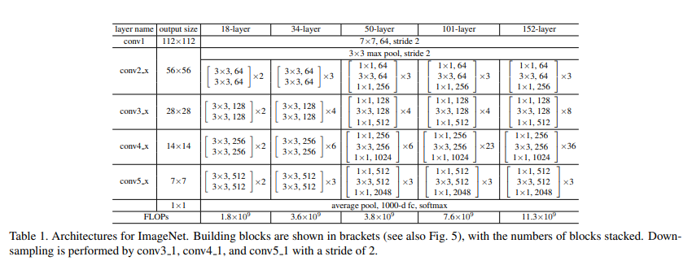
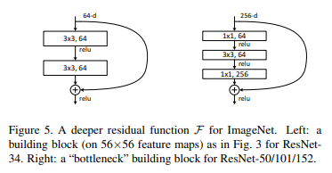

# [ResNet](https://arxiv.org/abs/1512.03385)
본 페이지에서는 ResNet의 등장배경과 특징에 대해서 말하고자 합니다.

---
## 1. ResNet 특징
네트워크의 깊이는 네트워크 성능에서 중요한 역할을 한다.

"레이어를 더 많이 쌓을 수록 네트워크의 학습이 더 잘 될 것인가?" 라는 질문을 시작으로 모델을 구현한다.

실제로 대조군(얕은 Network)을 두어 비교를 하면 성능이 향상되는 것을 어느정도 확인 함

위의 사진을 보면 분명 네트워크가 깊어졌음에도 불구하고 Error율은 높다.

그러나 네트워크가 깊어질 수록 Gradients Vanishing/Exploding 문제가 발생할 가능성이 높다.

이러한 문제점을 해결하기 위해 ResNet은 skip connection을 통해 residual learning이 가능하도록 함

## 2. Residual Block

기존의 블럭이라면 입력에 대해서 두 weight layer 를 F(x)라고 할 때 identity mapping을 추가하고 이를 F(x)와 더해주어 F(x)+x가 되고 기존의 H(x) = F(x) 였지만 H(x)= F(x)+x라고 재정의 한다. 즉 F(x)=H(x)-x가 되는 것이다.

역전파의 관점으로 보면 H(x)값과 x값은 이미 알고 있고 F(x)를 optimize 하면 되는 것이기 때문에 결국 H(x)-x를 optimize 하면 되는 것이다.

이때 H(x)=F(x)+x 는 Shortcut Connection을 통해 구현할 수 있다.

실험적으로 F(x)를 optimize 하는 것보다 F(x)= H(x)-x을 0으로 하면서 optimize 하는 것이 더 쉽다는 것을 알 수 있다.

이러한 구조를 통해 Gradients Vanishing/Exploding 문제를 해결할 수 있었고 이에 따라 더 깊게 쌓으면서 지속적인 성능 향상을 확인할 수 있었다.

## 3. 구조

  

34 layer residual 구조에서 실선은 identity skip connection을 의미하고 인풋이 그대로 넘어감을 의미한다.

점선은 identity skip connection을 의미하지만 그대로 넘어가는 것이 아닌 input과 output의 채널을 맞춰주기 위해 zero-padding을 사용하여 1x1 kernel size로 stride는 2와 함께 conv 연산을 진행한다.

# 3.1 Plain Network
구조는 주로 VGGNet의 영향을 받았다.

Conv 연산의 Kernel size는 주로 3x3을 사용하였고

Down sampling 연산은 stride를 2로 지정한 Conv 연산을 통해 구현한다.

# 3.2 Residual Network
Plain Network를 기반으로 하면서 Shortcut connection을 삽입했다.

Shortcut connection의 결과와 기존 layer의 결과를 pixel별로 더하는 연산을 진행한다.

# 3.3 성능비교 (PlainNet vs ResNet)

 

위의 이미지는 PlainNet과 ResNet 각각의 깊이별 training error를 그래프화 한 것이다.

PlainNet은 깊이가 깊어지면서 train error가 높아지는 것을 확인할 수 있지만

ResNet은 깊이가 깊어져도 지속적인 성능 향상이 보인다.

## 4. 상세구조

18,34,50,101,152 개의 레이어에 대한 모델들의 각각의 stage 구조를 나타내는 것이다.

이때 18,34 와 50,101,152의 residual block 구조는 아래의 사진과 같다.

왼쪽은 18,34-layer에 대한 residual block(building block)이고 오른쪽은 50,101,152에 대한 residua block(bottleneck block)이다.

이때 bottleneck block에서 1x1 conv의 역할은 차원을 줄이고 늘리는 역할을 한다.

---