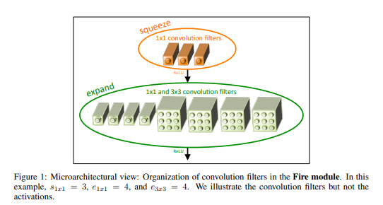
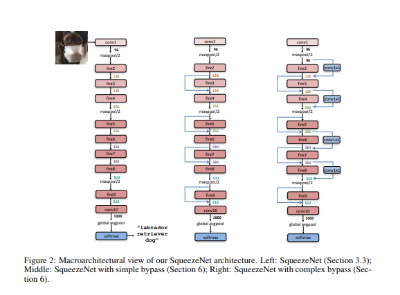
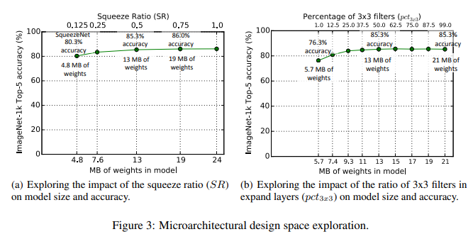
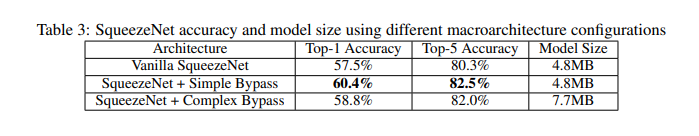

# [SqueezeNet](https://arxiv.org/abs/1602.07360)
본 페이지에서는 SqueezeNet의 등장배경과 특징에 대해서 말하고자 합니다.

---
## 1. SqueezeNet 특징

최근의 연구들은 모델의 성능을 향상시키는 방법만을 고려하였다.

SqueezeNet은 모델의 성능을 비교 할만큼 유지하면서 모델의 사이즈를 줄이는 것을 목적으로 한다.

Imagenet에서 AlexNet보다 50배 적은 파라미터의 수로 비슷한 성능을 냈다.

추가적으로 논문에서의 Compression 기술로 모델의 크기를 0.5Mb로 AlexNet의 510배를 줄일 수 있게 되었다.

작은 모델의 장점은 다음과 같다.

- More efficient distributed training

    1. server 사이의 communication은 distributed CNN training에서 의 확장성을 제한하는 요소이다.

    2. data parallel training에서 communication 오버헤드는 직접적으로 모델의 파라미터 수의 일부분으로 연결된다.

    3. 요약하면 작은 모델이 학습 되는 것이 더 빠른데 그 이유는 communication이 적기때문에 파라미터가 적어지기 때문이다.

- Less overhead when exporting new models to client

    1. 자율주행에서 그들의 새로운 모델을 주기적으로 server로부터 소비자의 차로 복사한다. 이를 over the air update라고 부른다.

    2. ALexNet은 server에서 차까지 240MB의 communication를 필요로 한다.

    3. 작은 모델은 더 적은 communication을 필요로하고 더 많은 업데이트가 가능하게 했다.

- Feasible FPGA and embedded deployment
    1. FPGA들은 대부분 10MB 보다 작은 on-chip memory이고 no off chip memory또는 저장소이다.

    2. 확실히 작은 모델은 영상 프레임이 real time으로 송출되는 동안 memory band-with에 병목이 되지 않고 FPGA에 직접적으로 저장되어질 수 있다. 

    3. 더 나아가 CNN을 ASIC에 적용하는 동안 충분히 작은 모델은 on cipp에 직접적으로 저장되고 작은 모델은 ASIC를 중간에 멈추는 것 없이 가능하게 했다.

## 2. MODEL COMPRESSION
기존의 모델들은 각 레이어의 filter를 선택하는 것이 트렌드였고

다양한 고수준의 빌딩 블럭과 모듈 그리고 여러 conv layer를 구성하면서 제안되어져왔다.

많은 모듈들은 완전한 network를 형성하기위해 아마 addtional ad-hoc layer와 합쳐졌다.

### CNN MICROARCHITECTURE
특별한 organization과 individual module들의 차원을 언급하기위해 CNN microarchitecture를 정의하였다,

### CNN MACROARCHITECTURE
googlelenet의 inception module, vgg net의 레이어 쌓는 것 등을 macro architecture라고한다.

### NEURAL NETWORK DESIGN SPACE EXPLORATION
design space는 microarchitecture,macro architecture,solver,그리고 하이퍼 파라미터 등을 얘기한다.

기존의 논문들은 성능 향상에 도움은 주었지만  NN design shape의 모양에 대한 intuition을 주진 못했다

Fire block은 CNN구조를 만드는데 새로운 building block 이다

## 3. ARCHITECTURAL DESIGN STRATEGIES
SqueezeNet의 목적은 적은 수의 파라미터로도 경쟁가능한 정확도를 유지하는 것이다. 그 방법에는 세가지 전략이 있다.

전략 1. 3x3filter를 1x1 filter로 바꾸는 것

전략 2. 3x3 filter의 input 채널의 수를 줄이는 것

전략 3. conv layer가 더 많은 activation map을 가지게 하기 위해서 downsample은 network에서 뒤에 배치한다.

전략 1과 2는 정확도를 어느정도 보장하면서 파라미터의 수를 줄인 것에 대한 것
전략 3은 제한된 파라미터 수에서 정확도를 최대화 하는 것

### 3.1 Strategy 1.
1x1 필터보다 3x3필터가 9배 더 많은 파라미터를 사용한다.

이러한 이유로 파라미터를 줄이기 위해서 3x3 filter대신 1x1 filter를 사용한다.

### 3.2 Strategy 2.
레이어 내의 전체 파라미터 수는 (input channel)*(output channel)*(filtersize^2)*(H*W)이다. 

전략 1에서 필터수를 줄인 상태이므로 파라미터 수를 줄이기 위해서는  input channel의 수를 줄이는 것이다

본 논문에서는 squeeze layer를 사용하여 input channel의 사이즈를 줄였다.

### 3.3 Strategy 3.

conv network에서, 각각의 레이어는 output activation map을 1x1 conv 또는 그보다 큰 NxN conv연산으로 만든다.
Height와 width는 adtivation map에 의해 정해진다.

activation map은 다음에 의해 제어된다.
(1) input data의 크기
(2) CNN 구조에서 downsample을 할 위치(어떤 layer에서 할지)

Down sampling이 stride가 1보다 큰 값으로 conv또는 pooling layer에서 진행되는데

초반의 layer 에서 stride가 큰 경우 , 대부분의 레이어는 작은 activation map을 가질 것이다.

반대로, 네트워크의 대부분이 srtide가 1일경우,그리고 stride들이 1보다 큰 경우가 네트워크의 끝에 집중이 된다면 (stride가 크면 이미지가 줄어드는 것을 말함 네트워크의 끝부분에서 이미지의 크기가 줄어드는 것이 많아진다면)

많은 레이어는 큰 activation map을 가질 것이다.

큰 activation map들(downsampling을 뒤쪽에 배치하기 때문에)이 높은 분류 정확도를 가진다는 것이 우리의 intuition이다.

## 4 Fire Module

fire module은 squeeze conv layer(1x1flter를 가진 conv layer)레이어와 expand layer(1x1과 3x3 conv filter를 가진 conv layer)로 이루어졌다.

fire module에서 1x1 filter의 사용은 3.1에서 전략 1을 적용하기 위한 것이다.

S(1x1) ,E(1x1) and E(3x3)은 Squeeze layer와 Expand layer의 필터의 수를 얘기하는 것이고 하이퍼 파라미터이다.

e(1x1)는 expand layer에서 1x1filter의 수를 얘기하는 것이고

e(3x3)은 expand layer에서 3x3의 필터의 수를 얘기하는 것이다.

S(1x1)는 (E(1x1)+e(3x3))보다는 항상 작아야한다.

## 5. THE SQUEEZENET ARCHITECTURE

Squeezenet은 standalone layer(conv1)로 시작하고 8개의 Fire-module이 따라오고(fire2_9) 최종 conv layer(conv10)로 끝낸다.

fire-module마다 필터의 수를 증가시킨다.

max-pooling 을 stride 2로 conv1 fire4 fire8 conf10 이후에 진행한다.

상대적으로 pooling을 network 뒤에 배치하는 것은 전략 3을 시행하려는 것이다.

### 5.1 OTHER SQUEEZENET DETAILS

Expand layer의 1x1과 3x3 필터로부터 나온 output은 같은 크기이다.(zero padding을 이용해 conv연산을 진행)

ReLU는 squeze와 expand layer뒤에 적용된다.

Drop Output은 0.5의 비율로 fire 9 module 뒤에 적용된다.

NiN 구조에 영향을 받아서 FC Layer가 없다.

Expand layer의 1x1conv와 3x3conv는 Squeeze layer의 결과를 입력으로 받고 1x1conv와 3x3conv의 결과를 concatenate하여 Fire-module의 결과로 한다.

### 5.2 CNN MICROARCHITECTURE METAPARAMETERS

Fire module은 S(1x1),E(1x1),E(3x3) 의 세가지 하이퍼 파라미터로 이루어져있다.

본 논문은 base(e)를 fire module에서 expand filter의 수라고 정의한다.

모든 freq Fire module의 이후에, expand filter의 수를 incr(e)만큼 증가시킨다.

Fire modul i에 대해서 expand filter의 수 Ei = base(e)+(incr(e)*floor(i/freq))이다.

Ei = Ei,1x1 + Ei,3x3으로 이루어져 있다.

Ei,3x3 = Ei*pct(3x3) 이고 Ei,1x1 = Ei*(1-pct(1x1))로 이루어져 있다.

pct(3x3) = [0,1]
fire module의 squeeze layer의 필터 수를 정하기 위해 squeeze ratio(SR[0,1])을 정했다. 

squeeze 필터 수 si,1x1 = ei*SR이다.

본 논문에서는 base(e)=128 ,incr(e)=128 pct(3x3)=0.5, freq=2,SR=0.125로 지정햇다.

### 5.3 SQUEEZE RATIO, TRADING OFF 1X1 AND 3X3 FILTERS

SR과 pct의 값에 의한 성능 변화는 다음 아래의 사진을 보고 비교하면 된다.

### 5.4 CNN MACROARCHITECTURE DESIGN SPACE EXPLORATION

microarchitecture 수준에서 디자인 공간에 대해서 연구함

본 논문의 bypass 구조에는 bypass connection을 fire module 3,5,7,9에 적용함

input 과 output에 대해서 resudual learning을 적용함

Fire 4의 input을 Fire 2의 output + Fire 3의 output으로 함

이를 통해 fire modele의 파라미터에 정규화를 적용에 대한 변화를 준다.

### 5.5 Simple,Complex Bypass connection

input 채널의 수와 output 채널의 수는 같아지는 경우에는

절반의 fire modul만 bypass connectio을 가진다. (simple bypass)

같은 수의 채널이 아니라면, complex bypass connection을 사용한다

simple bypas는 채널의 변화가 없기에 일반적인 skip connection이지만 

complax bypass는 I/O 채널의 수를 같게하는 1x1 conv layer를 포함한 것이다.

complex bypass는 simple bypass와는 다르게 추가적인 파라미터를 요구한다.

SR이 0.125인 것이 의미하는 것은 expand layer의 입력층의 갯수를 8배 줄인다는 것을 말한다.

이런 차원의 급격한 줄임때문에 , 정보의 양이 squeeze layer를 지나면서 줄어든다.

그러나 bypass connection을 추가하면서,squeeze layer 주변에서 정보의 흐름을 가능하게 하였다.

---