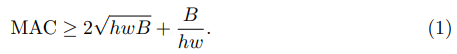
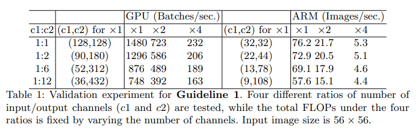
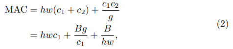
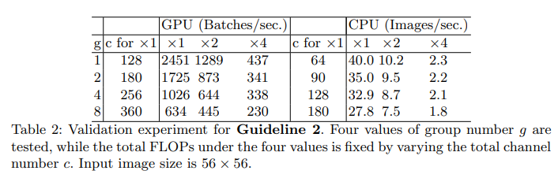
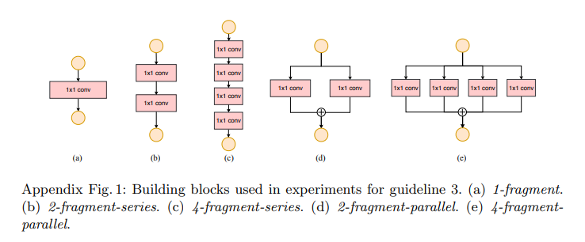
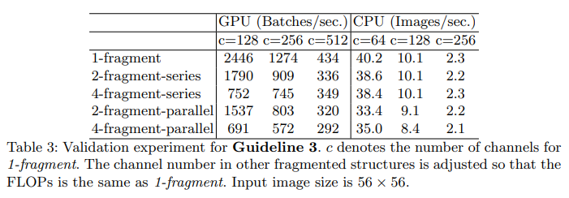
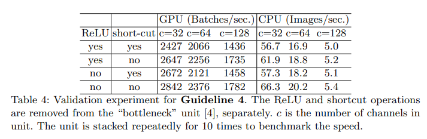
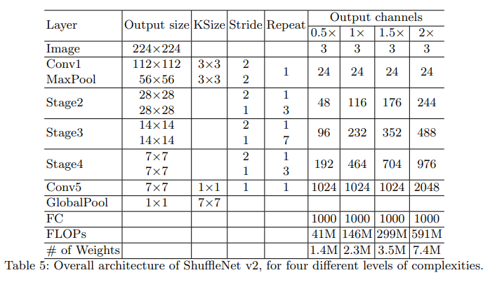
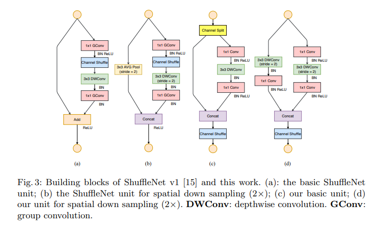

# [ShuffleNet V2](https://arxiv.org/abs/1807.11164)
본 페이지에서는 MobileNet의 등장배경과 특징에 대해서 말하고자 합니다.

---
## 1. ShuffleNet V2 특징
기존의 네트워크들은 사이즈를 줄이고 속도를 늘리기 위해 computation complexit의 indirect metric인 FLOPs만을 사용했다.

그러나 속도나 사이즈는 메모리 접근 비용과 플랫폼 특징과 같은 direct metric과 같은 것에도 영향을 받는다.

그래서 ShuffleNet V2 논문은 이러한 접근들에 대해서 연구한다.

## 2. Runtime

- FLOPs
    모델의 성능을 유지하면서 속도를 빠르게 하고 모델을 가볍게 만드는 간접 지표로 FLOPs를 사용하였다.

    이러한 지표를 토대로 Group Convolution과 Depthwise Convolution를 사용하였고 이러한 방식을 통해 FLOPs를 줄였다.

    그러나 FLOPs는 간접 지표이고 속도나 지연시간과 같이 신경써야 하는 부분에서는 직접적인 지표가 되지 않는 문제가 있다.

    MobileNet V2와 NASNET-A는 비슷한 FLOPs를 가졌으나 속도가 다르다.

    그러므로 FLOPs만을 computation complexity를 측정하기 위한 지표로 사용하기엔 충분하지 않다.

- Memory Access Cost(MAC)

MAC는 Group Convolution과 같은 연산에서의 실행 시간에 큰 영향을 차지한다.

- Degree of parallelism

    같은 수의 FLOPs에서 High degree of parallelism 이 Low degree of parallelism보다 더 빠른 속도로 처리한다.

- Platform

    같은 수의 FLOPs여도 Platform에 따라 실행 속도가 다르다.

앞의 요소를 고려해서 모델을 구현하는데 새로운 가이드 라인 4가지가 있다.

## 3. Guideline

위의 사진을 보면 실행 시간에 Conv 연산이 많은 부분을 차지하지만 FLOP이 적은 데이터 I/O ,shuffle ,element wise 연산과 같은 연산들도 생각보다 많은 부분을 차지한다.

그러므로 FLOP은 실제 실행시간을 판단하는 지표로는 부족하다

### 3.1 G1. Equal channel width minimizes MAC

최근의 모델들은 1x1 conv를 많이 사용하는데 이 연산의 FLOP은 B=hw(c1)(c2)이다.(h,w:이미지크기,c1,c2:I/O채널의 수)

Cache가 모든 feature map과 파라미터를 저장하기에 충분하다고 가정하면 MAC는 MAC=hw((c1)+(c2))+(c1)(c2)이다.

이때 식 (1)을 보면 MAC가 최소가 되는 지점은 B에 의해 정해지는데 input과 output의 채널의 수가 같이지는 지점이 최소가 된다.

테이블1을 보면 c1:c2의 비율이 1:1에 가까워질 수록 처리 속도가 빨라진다. 

이때 FLOPs의 크기는 같도록 조정함

### 3.2 G2. Excessive group convolution increases MAC.
Group conv연산은 FLOPs를 줄였고 이 때문에 모델이 더 많은 채널을 가질 수 있도록 하였다.

그러나 채널 수의 증가는 MAC의 증가를 야기시켰다.

G1과 식(1)을 고려하면 1x1 group conv에서 MAC와 FLOPs 사이의 관계 식은 식(2)와 같다.

B=hw(c1)(c2)/g ,g는 그룹의 수

이를 증명하기 위해 c1xhxw와 B를 고정시키고 g를 증가시켰다.

이때 GPU에서는 처리 속도의 변화가 크지만 CPU에서는 크지 않다.

이를 통해 platform과 작업의 특성을 고려해 g를 선택하는 것이 좋다.

### 3.3 G3. Network fragmentation reduces degree of parallelism.

하나의 큰 연산이 아닌 작은 연산들이 여러개 발생되면 속도가 느려진다.

예를 들어 NASNET-A는 한 블록 내에서 개별적인 conv 연산과 pooling 연산의 수가 13개인 반면 ResNet에서는 2개 또는 3개이다.

Frangemented 구조가 정확도에는 이득일지는 몰라도 효율성에서는 떨어진다. 그 이유는 GPU와 같은 병행 처리 시스템에서는 비효율적이기 때문이다.

이를 비교하기 위해 다른 수준의 fragmentation으로 이루어진 블록들을 만들었다. 

각각의 블록은 1~4개 사이의 1x1conv 연산으로 이루어져 있고 이 블럭들을 10개 쌓아서 실험했다.

### 3.4 G4. Element-wise operations are non-negligible.
ReLU,Add 등 과같은 element-wise 연산도 실행 시간에 많은 부분을 차지하고 있는 것을 Fig2에서도 볼 수 있다. FLOP은 작지만 MAC는 크다.

이를 확인하기 위해 ReLU 와 shortcut path의 사용 여부를 통해 속도를 비교했다.

### 3.5 Conclusion and Discussions
1.”balanced” conv연산을 사용하다(I/O의 채널의 수가 같음)

2.Group conv연산을 사용할 때 cost를 계산하자

3.fragmentation의 수를 줄이자

4.element-wise 연산을 줄이자.

위 네개를 고려해 SuffletNet V1의 sufflenet unit을 수정했다.

## 4. ShuffleNet V2 architecture

모델의 구조는 크게 변하지 않았지만 Global Pool 이전에 1x1 conv 연산이 추가되고 output channel의 값들이 변했다.

ShuffleNet Unit의 구조를 보면 아래와 가탇.

### 4.1 Problem: ShuffleNet V1
두 point wise group conv연산과 bottleneck 구조는 MAC를 무시 못할 정도로 증가시킨다.(G1과 G2)

많은 group을 사용하여 Group conv를 한다.(G3)

Shortcut connection으로써 Add 연산은 추가적인 elementwise 연산의 양을 증가시킨다.(G4)

높은 성능과 효율성을 얻기 위해 이러한 문제들을 해결 하기 위해 ShuffleNet V2를 만든다.

### 4.2 Channel Split and ShuffleNet V2

Fig 3 (c)에서 보이듯 channel split이라는 것을 보여준다.

각각의 unit의 시작할 때 c개의 채널을 c-c’개의 채널과 c’개의 채널로 나눈다.(G3)[논문에서는 c’ = c/2 로 설정했다.]

하나의 branch는 identity로 남겨둔다.

남은 하나는 입출력의 채널 수가 변하지 않도록 3개의 conv연산을 처리한다.(G1,partially G2)

이후 두 branch는 concatenate 연산을 통해 채널을 합친다. 이 때문에 unit의 입력 채널 수와 출력 채널 수는 같게 된다.

이후 channel shuffle 연산을 진행하여 두 branch가 정보를 주고 받도록 하게 한다.

Concat, shuffle , split이 연속적으로 처리가 된다.(G4)

### 4.3 Channel Split and ShuffleNet V2(stride)
Channel split 연산은 삭제되기 때문에 output 채널의 수는 두배가 된다.

(c)와는 동일하지만 skip path에서는 3x3 AVG Pool 대신 3x3 depthwise conv 연산과 1x1 conv연산을 진행한다.

---