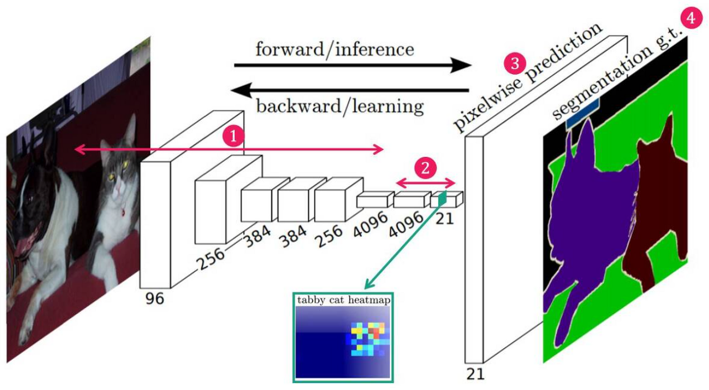
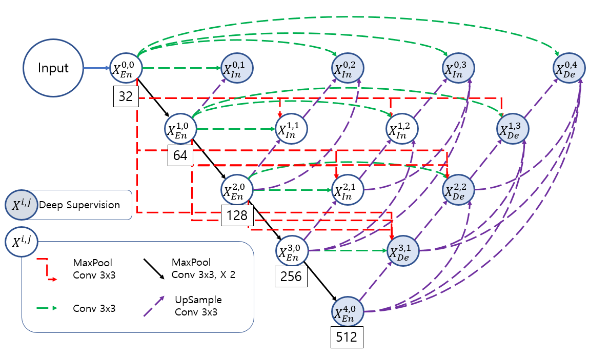
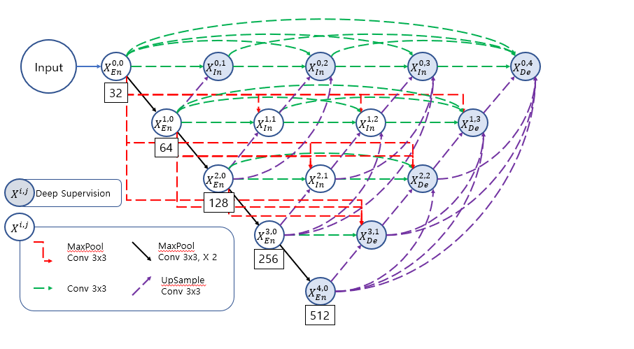
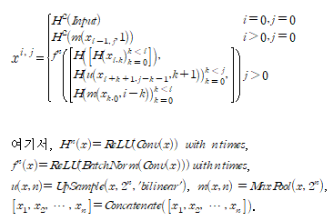
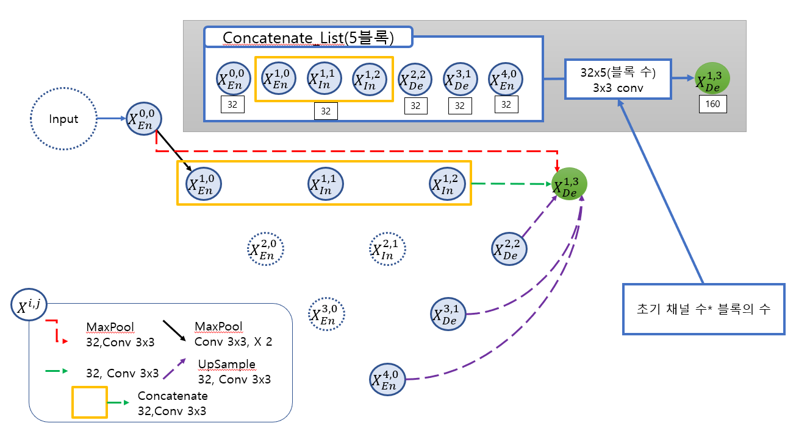
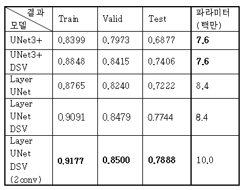

# [Layer UNet]
본 페이지에서는 Layer UNet의 등장배경과 특징에 대해서 말하고자 합니다.

---
## 1. UNet 이전의 Segmentation 작업

기존에 Segmentation 모델은 다양하지만 대표적인 예로 FCN 모델을 예로 들면 다음과 같다.

기존의 FCN 모델은 객체의 특징을 찾아낸 다음 Transposed Convolution 연산과 upsample을 통해 원본 이미지로 키우고 각 픽셀에 해당하는 클래스에 맞는 색상을 입히는 형태이다.

이와 같은 문제점은 원본 이미지의 크기로 키우는 과정에서 위치와 경계같은 정보에 대한 손실이발생하게 되고 부정확한 Segmentation을 하게 된다.

이러한 점을 해결한 것이 바로 UNet이다.

Decoder 과정에서 Encoder 부분에서 얻어낸 정보(feature map)를 Skip connection을 이용해서 위치 정보나 경계 정보 같은 semantic 정보의 손실을 줄이게 되었다.

이를 통해 적은 수의 이미지로도 정확한 이미지 segmentation이 가능하게 되었다.

---
## UNet 기반의 다른 모델들

 

두 모델은 대표적인 UNet 기반 모델로 각각 UNet++와 UNet3+이다.

두 모델은 공통적으로 UNET 모델의 Skip connection을 redesign 하여 Encoder 와 Decoder 사이의 위치정보와 같은 의미론적 차이를 줄여 더 정확한 세그멘테이션을 가능하게 하였다.

---
## 3. EUNET

EUNET의 구조는 다음과 같은데

처음 Layer UNet의 시작은 UNet3+의 구조를 모든 인코더 블록에 적용하면 의미론적 차이가 줄어들지 않을까? 라는 질문에서 시작했다.

여러 레벨에서의 Semantic 정보를 얻어내기 위해 UNet3+의 구조를 모든 Encoder 블록에 적용해 조금더 많은 semantic 정보를 얻어낸다. 이러한 결과를 Deep supervision으로 사용 하여 최종 결과적으로 semantic 정보의 차이를 줄인다.

이러한 구조의 문제점은 Deep supervision을 사용하지 않으면 UNet3+모델에서 Deep supervision을 사용하지 않은 것과 똑같아진다.

이러한 문제점을 해결하면서 의미론적 차이를 조금 더 줄이기 위해서 Layer UNet을 만들었다.

## 4. Layer UNET

Layer UNET의 구조는 다음과 같다.

각 블록에 대해 식으로 나타내면 다음과 같다.

EUNET과는 다르게 같은 수준에 있는 모든 블럭들을 모두 사용하였다.

pooling 연산은 stride와 kernel size를 동일하게 하여 겹치는 부분 없이 pooling 연산을 진행하였다.
모든 conv 연산은 stride=1로 고정 되며 kernel size=3로 고정하여 연산을 진행한다.

최종 블럭을 만들기 전의 conv연산 진행한 후의 블록의 채널수는 모두 32(초기 채널 수)로 고정된다.

최종적인 concatenate 연산 후의 conv 연산을 적용한 블록의 채널 수는 (초기 채널 수)*(concatenate연산을 할 블럭의 수) 이다.

본 논문에서 제안된 unet은 새로운 구조로 인한 파라미터수의 증가량을 줄이기 위해 skip connection를 재구성하였다.

블록을 만드는 과정에서 다른 수준의 블럭을 가져오는 과정은 UNet3+와 동일하나 같은 수준에 있는 블럭들을 가져오는 과정에 변화를 주었다. 

이전에 만들어진 같은 수준에 있는 블럭들에 대해서 각각 conv연산을 진행하여 채널수를 32로 만들어 준다.

이후 모든 블럭을 concatenate 연산을 해준다.

최종적으로 conv연산을 진행하여 32채널의 하나의 블록으로 만들어 준다.

이렇게 생성된 모든 블럭을 concatenate 연산을 진행 후 conv 연산을 진행하여 결과 블럭을 만들어준다.

이러한 방식을 통해 결론적으로 같은 수준의 있는 블럭들을 활용해 의미론적 차이를 줄이게 되었고 파라미터의 증가량을 줄일 수 있게 되었다.

이때 하나의 블록을 만드는 과정을 X(1,3)만드는 과정을 통해 보여주면 다음과 같다.

그림을 통해 X(1,3)블럭을 만드는 자세한 과정을 설명하는 다음과 같다. 

X(0,0)블럭을 kernel size를 2로 하여 maxpool 연산을 진행한 후 conv연산을 진행한다(B1).

X(1,0),X(1,1) 과X(1,2)  블럭은 각각 conv 연산을 진행 후 채널수를 32로 만들어 준 후 세개의 블록을 concatenate 연산을 한 후에 conv 연산을 진행하여 32채널로 다시 만들어준다.

이때 이 결과를 하나의 블럭으로 생각한다(B2). 

X(2,2),X(3,1),X(4,0)블럭은 각각 scale을 2,4,8로 하여 upsample 연산을 진행한 후 conv 연산을 진행한다(B3,B4,B5).

이렇게 생성된 5개의 블럭(B1,B2,B3,B4,B5)을 concatenate 연산을 진행한 후 conv연산을 통해 32*5의 채널의 X(1,5) 블럭을 만든다.

치아 데이터 셋에 대해서 성능을 비교한 표는 다음과 같다.(mIoU)

## 4.1 Dataset

환자 3명의 치아 CBCT 데이터를 사용하여 Layer UNET을 학습하고 평가하였다. 

학습에 사용되는 치아 데이터셋은 환자 2명(환자 1, 2)의 CBCT 데이터이고 하나의 CBCT는 280개의 슬라이스 이미지로 이루어져 있다. 

나머지 환자 1명(환자 3)의 CT 데이터는 학습된 모델의 평가를 위한 시험용(test)으로 사용되었다. 

학습용 데이터 총 560개의 슬라이스 이미지에서 무작위로 448장을 학습용으로 나머지 112장 검증용(validation)으로 사용하였다. 

학습에 사용하지 않은 CT 데이터에 대한 모델의 성능 시험용으로 환자 3의 슬라이스 이미지 150장을 사용하였다.

---