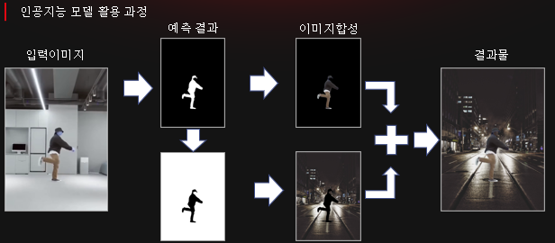
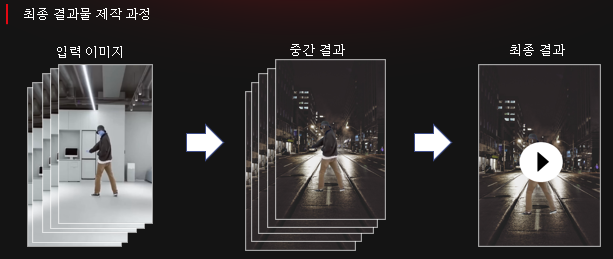
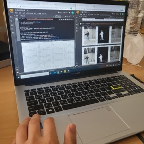

# StopMotion Project(팀 프로젝트)

옷이 공중에 떠다니면서 춤을 추는 스탑모션을 딥러닝을 통해 구현하고자 했습니다.

AI Model로는 Layer UNET을 사용하였고 모델의 활용 과정은 아래와 같습니다.

이때 아래의 이미지에서 이미지 합성의 의미는 bitwise 연산을 의미합니다.

이렇게 얻어낸 이미지들을 프레임 별로 묶어 일부 사진을 제외하면서 프레임을 조절하면 stop motion의 효과를 낼 수 있습니다.

이 활동의 의의는 인공지능을 통해 기존의 방법보다 쉬운 방식으로 스탑모션을 재현할 수 있다는 것입니다.

팀장:모델 구현 파이프라인 구축