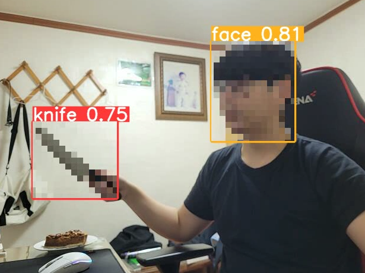
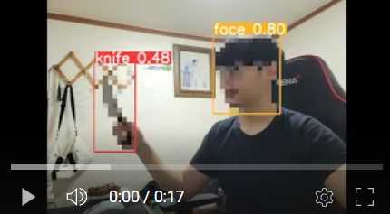
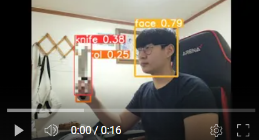
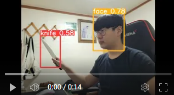
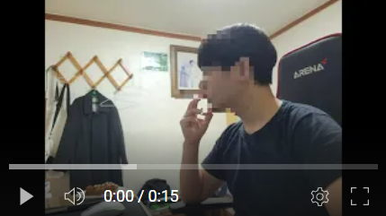

# Mosaic Project(개인)[YOLO V5]

위험한 물건,청소년이 보기에 문제가 되는 것,신상 등을 모자이크 하는 방법을 조금 더 편하게 딥러닝을 활용해서 처리하고자 프로젝트를 진행하였습니다.

Yolo V5를 사용해서 객체를 탐지해서 해당 영역을 모자이크 처리하는 방식을 사용했습니다.



구별해내는 클래스는 총 6개로 다음과 같습니다.

Classes:
0:칼
1:장총
2:권총
3:사람 얼굴
4:담배
5:문신,타투

또한 기존에는 존재하지 않았던 파라미터이지만

사용할 때 --obj [클래스 넘버]라는 파라미터를 사용해 특정 클래스만 모자이크를 처리할 수 있도록 하였습니다.

추가적으로 실제로 사용할 때 모자이크만 처리될 수 있도록 --hide-annotation이라는 파라미터를 추가해 바운딩 박스,라벨이 안뜨도록 설정할 수 있습니다.

추가적으로 일부 모델만이 사용 가능한 것이 아닌 모든 모델에 대해서 사용이 가능합니다.

## 1. 사용 방법

```
!git clone https://github.com/ultralytics/yolov5  
```

1. yolov5 클론
위의 코드를 사용해 clone을 해줍니다.

2. detect-mosaic.py 삽입
yolo v5내에 제 깃허브에 있는 detect-mosaic.py를 넣어줍니다.

3. 원하는 모델을 사용하여 --obj 파라미터로 원하는 객체만을 모자이크 할 수 있습니다.

## 2. 사용 코드와 실행 영상
```
--obj [] #모든 객체에 대해서 모자이크를 처리 
--obj [-1] #모든 객체에 대해서 모자이크를 처리하지 않음
--obj [1,2] #1번과 2번 클래스에 대해서 모자이크를 처리함
```

```
#전체 모자이크
D:\anaconda3\python.exe C:\Users\fhsdn\Desktop\yolov5\detect-mosaic.py --weights C:/Users/fhsdn/Desktop/detect/models/200.pt --source 0 --obj []
#or
D:\anaconda3\python.exe C:\Users\fhsdn\Desktop\yolov5\detect-mosaic.py --weights C:/Users/fhsdn/Desktop/detect/models/200.pt --source 0 --obj []
```

[](https://youtu.be/1s7kCSHE_y8)

```
#일부 모자이크
D:\anaconda3\python.exe C:\Users\fhsdn\Desktop\yolov5\detect-mosaic.py --weights C:/Users/fhsdn/Desktop/detect/models/200.pt --source 0 --obj [1,4]
```

[](https://youtu.be/uOG80WX8hiI)

```
#모자이크 처리 x
D:\anaconda3\python.exe C:\Users\fhsdn\Desktop\yolov5\detect-mosaic.py --weights C:/Users/fhsdn/Desktop/detect/models/200.pt --source 0 --obj [-1]
```
[](https://youtu.be/Zm7MMylasS4)

```
#모자이크 처리 + 바운딩박스 삭제
D:\anaconda3\python.exe C:\Users\fhsdn\Desktop\yolov5\detect-mosaic.py --weights C:/Users/fhsdn/Desktop/detect/models/200.pt --source 0 --obj [] --hide-annotation
```

[](https://youtu.be/N6j2c6EkgZ8)

## 3. 데이터 셋 구성

RoboFlow라는 사이트를 이용해 각 객체에 대한 데이터 셋을 얻은 후(dataset 폴더에 있음) 데이터 셋의 클래스 넘버를 수정하고 한 폴더 내로 합쳐 학습을 진행 했습니다.

또한 Yaml 파일을 data.yaml의 내용과 같이 수정하여 학습시켰습니다.

## 4. Detect-mosaic.py

### 4.1 파라미터 변경점
```python 3

# list 객체를 파라미터로 받아줌

...

import ast #list형식을 arg로 받기 위한 라이브러리
...

def run(
        ...
        hide_annotation=False,
        ...
        obj=[]
):

...


def arg_as_list(s):
    v = ast.literal_eval(s)
    if type(v) == list:
        return v
    else :
        return []

def parse_opt():
    parser = argparse.ArgumentParser()
    
    #...

    parser.add_argument('--hide-annotation', default=False, action='store_true', help='hide annotation') #해당 파라미터를 추가해 annotation을 숨길지말지 정함
    
    #...

    parser.add_argument('--obj', type=arg_as_list, default=[], help='mosaic object list([]=mosaic all,[-1]=nothing)') #모자이크 할 리스트를 받아옴
    opt = parser.parse_args()
    opt.imgsz *= 2 if len(opt.imgsz) == 1 else 1  # expand
    print_args(vars(opt))
    return opt


```


### 4.2 Run 코드 

```python3

    source = str(source)
    save_img = not nosave and not source.endswith('.txt')  # save inference images
    is_file = Path(source).suffix[1:] in (IMG_FORMATS + VID_FORMATS)
    is_url = source.lower().startswith(('rtsp://', 'rtmp://', 'http://', 'https://'))
    webcam = source.isnumeric() or source.endswith('.streams') or (is_url and not is_file)
    screenshot = source.lower().startswith('screen')
    if is_url and is_file:
        source = check_file(source)  # download

    # Directories
    save_dir = increment_path(Path(project) / name, exist_ok=exist_ok)  # increment run
    (save_dir / 'labels' if save_txt else save_dir).mkdir(parents=True, exist_ok=True)  # make dir

```
기본적인 파라미터 받는 곳으로 데이터 입력이 어디로부터 오는지 체크하는 곳이다.

```python3
    # Load model
    device = select_device(device)
    model = DetectMultiBackend(weights, device=device, dnn=dnn, data=data, fp16=half)
    stride, names, pt = model.stride, model.names, model.pt
    imgsz = check_img_size(imgsz, s=stride)  # check image size
```

장치 설정과 함께 모델 파라미터 수정


```python3
    mosaic_list = [] #각 객체별모자이크 처리 여부

    for i in range(len(names)):
        mosaic_list.append(0)
    
    if len(obj)==0:
        for i in range(len(mosaic_list)):
            mosaic_list[i] = 1
    else :
        for i in range(len(obj)):
            if (0 <= obj[i] and obj[i]<len(names)):
                mosaic_list[obj[i]] = 1

    print(f'객체들 : {names}')
```

개인적으로 추가한 코드로 모자이크할 객체들의 정보를 처리하는 코드다

```python3
    # Dataloader
    bs = 1  # batch_size
    if webcam:
        view_img = check_imshow(warn=True)
        dataset = LoadStreams(source, img_size=imgsz, stride=stride, auto=pt, vid_stride=vid_stride)
        bs = len(dataset)
    elif screenshot:
        dataset = LoadScreenshots(source, img_size=imgsz, stride=stride, auto=pt)
    else:
        dataset = LoadImages(source, img_size=imgsz, stride=stride, auto=pt, vid_stride=vid_stride)
    vid_path, vid_writer = [None] * bs, [None] * bs
```

데이터의 입력에 대해서 이미지 ,영상,웹캠인지 파악후 어떤 장치로 입력을 받을지 설정

```python3
    # Run inference
    model.warmup(imgsz=(1 if pt or model.triton else bs, 3, *imgsz))  # warmup
    seen, windows, dt = 0, [], (Profile(), Profile(), Profile())
```

모델을 그냥 진행하면 delay가 생기기도 하는데 모델을 장치에 통과시킴으로 어느정도 해결이 가능하게 됨


``` python3
    for path, im, im0s, vid_cap, s in dataset:
        if cv2.waitKey(1) != -1:
            break
        with dt[0]:
            im = torch.from_numpy(im).to(model.device)
            im = im.half() if model.fp16 else im.float()  # uint8 to fp16/32
            im /= 255  # 0 - 255 to 0.0 - 1.0
            if len(im.shape) == 3:
                im = im[None]  # expand for batch dim

        # Inference
        with dt[1]:
            visualize = increment_path(save_dir / Path(path).stem, mkdir=True) if visualize else False
            pred = model(im, augment=augment, visualize=visualize)

        # NMS
        with dt[2]:
            pred = non_max_suppression(pred, conf_thres, iou_thres, classes, agnostic_nms, max_det=max_det)
```

구축된 데이터에 대해서 입력이미지 im을 전처리 해주어 model의 input으로 넣어주고 non max suppression을 적용한다.

non_max_suppression은 모델이 예측한 객체에 대한 많은 bbox중 제일 좋은 것을 고르고 나머지는 제거하는 것이다.

알고리즘은 다음과 같다.
1. bbox별로 Confidence threshold 이하의 bounding box는 제거한다.
2. 가장 높은 confidence score를 가진 bbox 순으로 내림차순 정렬한다.
3. 가장 높은 confience score를 가진 bbox와 겹치는 bbox를 모두 조사하여 두 bbox에 대한 IoU가 특정 threshold 이상인 bbox를 모두 제거한다.

4. 남은 bbox만 전달.

3. 에서 IoU 가 특정 threshold가 일정 이상이면 같은 물체를 나타내는 거라고 판단하는 것임

```python3
        for i, det in enumerate(pred):  # 하나의 이미지 또는 프레임에 대한 예측

            position = [] # 각 객체에 대한 좌표 x1,y1,x2,y2

            seen += 1
            if webcam:  # batch_size >= 1
                p, im0, frame = path[i], im0s[i].copy(), dataset.count
                s += f'{i}: '
            else:
                p, im0, frame = path, im0s.copy(), getattr(dataset, 'frame', 0)

            p = Path(p)  # to Path
            save_path = str(save_dir / p.name)  # im.jpg , 저장될 이미지 파일
            txt_path = str(save_dir / 'labels' / p.stem) + ('' if dataset.mode == 'image' else f'_{frame}')  # im.txt ,검출된 객체에 대한 클래스 와 좌표 정보 저장될 파일임
            s += '%gx%g ' % im.shape[2:]  # print string , 현재 진행상황 표시
            gn = torch.tensor(im0.shape)[[1, 0, 1, 0]]  # normalization gain whwh
            imc = im0.copy() if save_crop else im0  # for save_crop
            annotator = Annotator(im0, line_width=line_thickness, example=str(names)) #im0를 가지고 annotation 준비

```

예측 결과를 itorator로 반환해 사용한다.

s라는 변수에는 프레임당 어떤 객체가 검출됐는지 알려주기 위한 str이다.

position 리스트는 검출된 객체의 좌표를 저장하는 리스트이다.

annotator는 바운딩 박스 ,객체 이름에 대해 이미지 위에 표시하는 것이다.

```python3
            if len(det):
                # Rescale boxes from img_size to im0 size
                det[:, :4] = scale_boxes(im.shape[2:], det[:, :4], im0.shape).round()

                # Print results
                

                for c in det[:, 5].unique(): #각 객체마다의 개수 구해서 한번에 출력
                    n = (det[:, 5] == c).sum()  # detections per class
                    s += f"{n} {names[int(c)]}{'s' * (n > 1)}, "  # add to string

                # Write results

                m = im0.copy() ##모자이크 이미지를 만들어주기 위해 이미지를 줄이고 키움
                m = cv2.resize(m,(im0.shape[1]//10,im0.shape[0]//10))
                m = cv2.resize(m,(im0.shape[1],im0.shape[0]),interpolation=cv2.INTER_AREA)

                
                for *xyxy, conf, cls in reversed(det):
                    if save_txt:  # Write to file 각 객체의 클래스 정보 좌표 정보 저장 과정
                        xywh = (xyxy2xywh(torch.tensor(xyxy).view(1, 4)) / gn).view(-1).tolist()  # normalized xywh
                        line = (cls, *xywh, conf) if save_conf else (cls, *xywh)  # label format
                        with open(f'{txt_path}.txt', 'a') as f:
                            f.write(('%g ' * len(line)).rstrip() % line + '\n')

                    if save_img or save_crop or view_img:  # Add bbox to image
                        c = int(cls)  # integer class
                        if mosaic_list[c] == 1: #해당 클래스가 모자이크 하기로 됐다면
                            position.append(xyxy) #좌표 정보 저장
                        label = None if hide_labels else (names[c] if hide_conf else f'{names[c]} {conf:.2f}') # 바운딩 박스에 객체명 표시
                        if hide_annotation == False: 
                            annotator.box_label(xyxy, label, color=colors(c, True))# 바운딩 박스 표시
                    if save_crop:
                        save_one_box(xyxy, imc, file=save_dir / 'crops' / names[c] / f'{p.stem}.jpg', BGR=True) # 해당 객체 부분만 이미지 저장
```

검출된 객체가 하나라도 있는 경우에는 바로 annotation 처리

```python3

            im0 = annotator.result() #im0에 annotator의 결과를 입력

            for j in range(len(position)): # 각 객체의 좌표값을 토대로 모자이크 처리
                for k in range(len(position[j])):
                    position[j][k] = int(position[j][k])
                im0[position[j][1]:position[j][3],position[j][0]:position[j][2],:] = m[position[j][1]:position[j][3],position[j][0]:position[j][2],:]

            if view_img:
                if platform.system() == 'Linux' and p not in windows:
                    windows.append(p)
                    cv2.namedWindow(str(p), cv2.WINDOW_NORMAL | cv2.WINDOW_KEEPRATIO)  # allow window resize (Linux)
                    cv2.resizeWindow(str(p), im0.shape[1], im0.shape[0])
                cv2.imshow(str(p), im0) #im0값을 출력
                cv2.waitKey(1)  # 1 millisecond
```

처리된 im0를 모자이크 처리하고 출력

```python3
            # Save results (image with detections)
            if save_img:
                if dataset.mode == 'image':
                    cv2.imwrite(save_path, im0)
                else:  # 'video' or 'stream'
                    if vid_path[i] != save_path:  # new video
                        vid_path[i] = save_path
                        if isinstance(vid_writer[i], cv2.VideoWriter):
                            vid_writer[i].release()  # release previous video writer
                        if vid_cap:  # video
                            fps = vid_cap.get(cv2.CAP_PROP_FPS)
                            w = int(vid_cap.get(cv2.CAP_PROP_FRAME_WIDTH))
                            h = int(vid_cap.get(cv2.CAP_PROP_FRAME_HEIGHT))
                        else:  # stream
                            fps, w, h = 30, im0.shape[1], im0.shape[0]
                        save_path = str(Path(save_path).with_suffix('.mp4'))  # force *.mp4 suffix on results videos
                        vid_writer[i] = cv2.VideoWriter(save_path, cv2.VideoWriter_fourcc(*'mp4v'), fps, (w, h))
                    vid_writer[i].write(im0)
```

입력 이미지의 특성(영상,이미지,웹캠) 에 따라 저장

```python3
        # Print time (inference-only)
        LOGGER.info(f"{s}{'' if len(det) else '(no detections), '}{dt[1].dt * 1E3:.1f}ms")

    # Print results
    t = tuple(x.t / seen * 1E3 for x in dt)  # speeds per image
    LOGGER.info(f'Speed: %.1fms pre-process, %.1fms inference, %.1fms NMS per image at shape {(1, 3, *imgsz)}' % t)
    if save_txt or save_img:
        s = f"\n{len(list(save_dir.glob('labels/*.txt')))} labels saved to {save_dir / 'labels'}" if save_txt else ''
        LOGGER.info(f"Results saved to {colorstr('bold', save_dir)}{s}")
    if update:
        strip_optimizer(weights[0])  # update model (to fix SourceChangeWarning)
```

하나의 이미지 또는 프레임에 대한 출력 시간이고 아래는 최종적인 결과를 표시함

    
