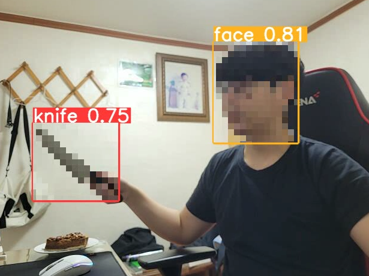

# Mosaic Project(개인)

위험한 물건,청소년이 보기에 문제가 되는 것,신상 등을 모자이크 하는 방법을 조금 더 편하게 딥러닝을 활용해서 처리하고자 프로젝트를 진행하였습니다.

Yolo V5를 사용해서 객체를 탐지해서 해당 영역을 모자이크 처리하는 방식을 사용했습니다.



구별해내는 클래스는 총 6개로 다음과 같습니다.

Classes:
0:칼
1:장총
2:권총
3:사람 얼굴
4:담배
5:문신,타투

또한 기존에는 존재하지 않았던 파라미터이지만

사용할 때 --obj [클래스 넘버]라는 파라미터를 사용해 특정 클래스만 모자이크를 처리할 수 있도록 하였습니다.

추가적으로 실제로 사용할 때 모자이크만 처리될 수 있도록 --hide-annotation이라는 파라미터를 추가해 바운딩 박스,라벨이 안뜨도록 설정할 수 있습니다.

추가적으로 일부 모델만이 사용 가능한 것이 아닌 모든 모델에 대해서 사용이 가능합니다.

## 사용 방법

```
!git clone https://github.com/ultralytics/yolov5  
```

1. yolov5 클론
위의 코드를 사용해 clone을 해줍니다.

2. detect.py 대체
yolo v5내에 있는 detect.py를 제 깃허브에 있는 detect.py로 대체합니다.

3. 원하는 모델을 사용하여 --obj 파라미터로 원하는 객체만을 모자이크 할 수 있습니다.

## 사용 코드와 실행 영상
```
--obj [] #모든 객체에 대해서 모자이크를 처리 
--obj [-1] #모든 객체에 대해서 모자이크를 처리하지 않음
--obj [1,2] #1번과 2번 클래스에 대해서 모자이크를 처리함
```

```
#전체 모자이크
D:\anaconda3\python.exe C:\Users\fhsdn\Desktop\yolov5\detect.py --weights C:/Users/fhsdn/Desktop/detect/models/200.pt --source 0 --obj []
#or
D:\anaconda3\python.exe C:\Users\fhsdn\Desktop\yolov5\detect.py --weights C:/Users/fhsdn/Desktop/detect/models/200.pt --source 0 --obj []
```

[](https://youtu.be/1s7kCSHE_y8)

```
#일부 모자이크
D:\anaconda3\python.exe C:\Users\fhsdn\Desktop\yolov5\detect.py --weights C:/Users/fhsdn/Desktop/detect/models/200.pt --source 0 --obj [1,4]
```

[](https://youtu.be/uOG80WX8hiI)

```
#모자이크 처리 x
D:\anaconda3\python.exe C:\Users\fhsdn\Desktop\yolov5\detect.py --weights C:/Users/fhsdn/Desktop/detect/models/200.pt --source 0 --obj [-1]
```
[](https://youtu.be/Zm7MMylasS4)

```
#모자이크 처리 + 바운딩박스 삭제
D:\anaconda3\python.exe C:\Users\fhsdn\Desktop\yolov5\detect.py --weights C:/Users/fhsdn/Desktop/detect/models/200.pt --source 0 --obj [] --hide-annotation
```

[](https://youtu.be/N6j2c6EkgZ8)