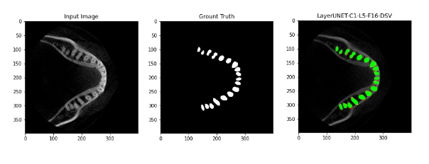

# Teeth Segmentation Project(논문)

3D CBCT 이미지에 대해서 Z축을 기준으로 slice한 다음 각각의 이미지를 모델에 학습시키는 방법을 사용하였고

치아 이미지에 대해서 치아와 턱뼈를 분리해내고 치아만을 Segmentation하는 방법을 사용하였다.

위의 사진은 실제 치아를 분리하는 과정이며

아래와 같은 처리를 통해 3D STL파일로 변환한다.

각각의 슬라이드 하나하나를 모델에 입력해서 결과를 출력하고 Threshold를 0.5로 주어 1과 0으로 만든 다음 해당 이미지를 하나하나 쌓아 STL파일로 만들어낸다.

결과이미지는 아래와 같다.

