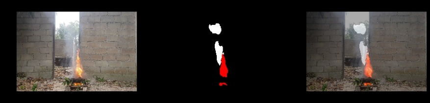
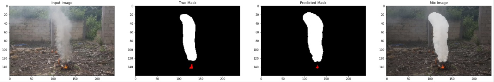

# 화재 탐지 Segmentation

화재를 조금 더 정밀하게 탐지하기 위해 Segmentation 모델을 사용했다.

비록 UNet 모델은 의료 이미지에 적합한 모델이지만 다른 segmentation 모델로도 충분히 segmentation이 가능하기에 우선 UNET 모델로 테스트 했다.

하이퍼 파라미터에 대한 얘기는 코드 내에 있습니다.

GTX 1060 그래픽 카드로 초당 10장의 이미지를 처리할 수 있다.

## Real time 실행영상

[https://www.youtube.com/embed/d2gssF8AygE]

핸드폰 카메라와 컴퓨터를 연결하여 실시간으로 Segmentaion 되는 것을 표현함

카메라는 화재 영상을 찍고 있다.(실습으로 불을 내는 환경을 찾기 어렵기 때문에 이렇게 했습니다.)

## 결과

검은색 빨간색 파란색 회색 흰색 은 각각
배경,불,검은 연기,회색 연기,흰색 연기를 의미합니다.

### Test
좌:Input 중:Mask 우:Mix(Input+Mask)

### Train

