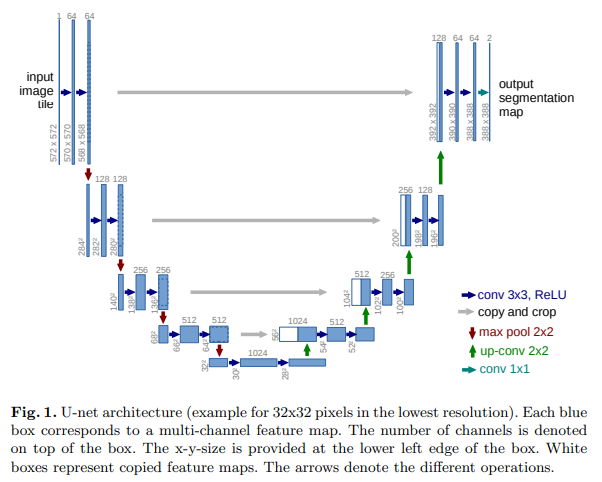
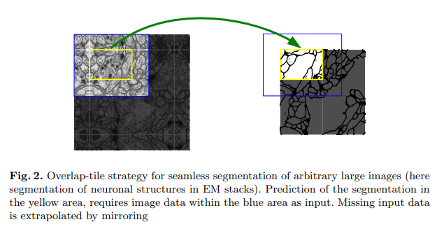

# [UNet](https://arxiv.org/abs/1505.04597)
본 페이지에서는 UNet의 등장배경과 특징에 대해서 말하고자 합니다.

---

## 1. UNET 특징

이전의 모델들은 모델의 크기에 비해 학습 데이터가 적어서 성능 향상은 이루어지지만 어느정도 제한이 있었다.

또한 기존의 Segmenation 방식은 두가지 취약점이 있는데

첫번째로 patch를 분리해서 실행되고 patch가 겹치면서 중복이 너무 많아 모델이 너무 느리다는 것이고

두번째로 패치가 오직 적은 부분의 context 정보 만을 보기 때문에 context 정보의 사용과 위치정보의 정확성 사이의 trade off가 있다는 것이다.

UNET 은 다음과 같은 두 구조로 나뉘는데 

위 이미지에서 절반을 기준으로 왼쪽을 Contracting path(수축) 오른쪽을 Expanding path(팽창)라고 한다.

Contracting path는 위치정보와 context정보를 추출하고

Expaning path는 정확한 위치를 파악하게 할 수 있다.

본 모델은 FCN을 기반으로 구현이 됐는데 이 구조는 적은 수의 의미지로도 정확한 segmentation을 가능하게 했다.

팽창 경로의 구현은 수축 경로와 비슷하지만 pooling 연산을 upsample 연산으로 바꾸는 방법을 사용했다.

upsample을 하면 해상도가 커지게 되는데 이때 위치 정보를 얻어내기위해 수축 경로의 feature와 upsample된 출력을 결합한다.

이러한 구조 때문에 context 정보의 손실을 보완할 수 있게 되는 것이다.

이후 이어지는 Convolution layer는 이를 바탕으로 더 정확한 출력을 낼 수 있도록 학습된다.

이를 반복해 다양한 레이어의 출력을 이용하는 것은 위치정보와 context 정보 사용을 동시에 가능하게 했다.

그러나 이러한 구조 때문에 아래의 그림처럼 원본 이미지보다는 적은 경계에 대해서 segmentation이 된다.

또한 이런 구조 덕분에 적은 수의 데이터 셋으로도 학습이 쉽게 가능해지는 것이였고 이러한 특성 때문에 데이터 셋이 부족하고 높은 정확도를 요구하는 의료 이미지에 대해 적합한 모델인 것이다.

## 2. 구조

수축 경로는 일반적인 conv network와 비슷한 구조를 따르곤다. (3x3conv->ReLU->3x3conv->ReLU->MaxPool)

팽창 경로는 다음과 같이 구성된다. Upsample-> 2x2Conv(채널수 줄이기) ->3x3 Conv -> ReLU->3x3 Conv -> ReLU

이때 upsample된 feature는 수축경로의 같은 높이에 있는 feature map과 concatenate 연산을 한다.

최종적으로 1x1 conv를 사용해 클래스에 맞는 채널의 수로 전환해준다.

논문대로 구현을 한다면(conv연산을 할때 zero padding을 사용하지 않음) Fig 2 처럼 작은 이미지가 나오지만 구현을 할 때는 zero padding을 사용함

---