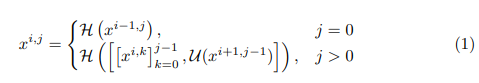

# [UNet++](https://arxiv.org/abs/1807.10165)
본 페이지에서는 UNet++의 등장배경과 특징에 대해서 말하고자 합니다.

---

## 1. UNET++의 특징

UNet++는 각 네트워크가 Dense하게 연결되어 있는 skip connection을 가지고 있다.

이러한 구조가 encoder와 decoder 사이의 의미론적 차이를 줄일 수 있게 하였다.

본 논문에서는 encoder와 decoder 사이에 의미론적 차이가 적을 수록 학습이 더 잘된다고 주장한다.

그리고 Deep supervision을 사용하여 좋은 성능을 냈음을 mIoU를 사용해 증명했다.

기존의 네트워크들의 공통점은 encoder와 decoder 사이에 의미론적 차이가 줄어들게 하는 skip connection을 사용한 것이다.

또한 기존의 네트워크들은 성능을 만족할만큼 올렸지만 의료 이미지에 사용하기는 애매한 성능이다.

의료 이미지에서 부정확한 segmentation은 치명적이기 때문에 UNET++를 제안한다.

## 2. UNET++의 구조

UNET의 기본 구조를 가지면서 skip connection 방법을 수정했는데 아래의 그림을 참고하자.

같은 층에 있는 layer들은 Dense Convolution layer를 따른다.

이렇게 얻어진 layer들을 concatenate한 후 아래의 dense block과 함께 또 concatenate연산을 하고 Conv 연산을 진행한다.

이를 식으로 표현하면 아래와 같은데 i는 레벨을 나타내고 j은 같은 층의 블럭 index를 말한다.

이때 H는 Convolution -> ReLU를 의미한다. 

[]는 concatenate 연산을 의미하고

u는 upsample을 의미한다.

## 3. Deep supervision

Deep supervision은 두가지 모드를 가능하게 하는데 기능은 아래와 같다

accurate mode: 모든 출력을 평균을 내어 사용하는 것

fast mode:마지막 출력만을 사용하는 것

---

Pruning

---

Pruning은 Fig1에서 C부분을 보면 확인할 수 있고 다양한 Pruning에서의 성능 수치는 ㄷ다음과 같다.

## 4. Dice-Cross entrophy

UNet++에서는 Binary Cross Entrophy loss와 dice coeifficient를 결합해 Loss 함수로 사용하엿고 그 식은 아래와 같다.

---
