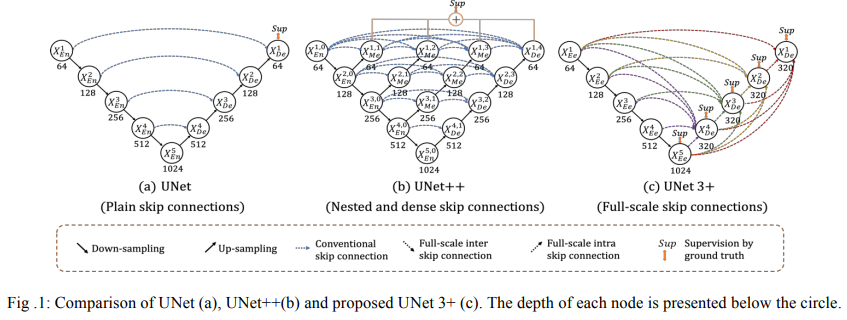
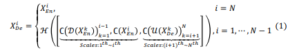
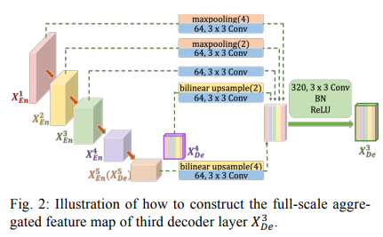
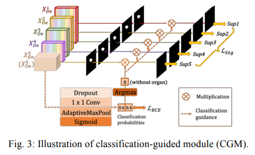

# [UNet3+](https://arxiv.org/abs/2004.08790)
본 페이지에서는 UNet3+의 등장배경과 특징에 대해서 말하고자 합니다.

---
## 1. UNET 3+의 특징
기존의 UNET구조는 encoder-decoder 구조를 가진 medical image segmentation 모델이다.

UNET++는 skip connection 구조를 재구성하여 성능을 향상시켰지만 full scale의 측면에서의 정보를 얻지는 못한다.

UNET과 UNET++ 둘다 skip connection 구조를 통해 의미론적 차이를 줄일 수 있었지만 아직은 부족하다.

UNET 3+는 full scale skip connection을 통해 저수준의 정보와 고수준의 정보를 모두 혼합했지만 더 적은 수의 파라미터를 요구한다.

deep supervision을 사용해 높은 정확도를 얻었다.

추가적으로 hybrid loss와 classification guided module을 사용해 성능을 올렸다.

## 2. 구조

UNET3+의 구조는 Fig1의 C와 같다.

이를 식으로 표현하면 아래와 같다.

여기서 C는 Conv operation을 말하는 것이고 H는 Conv->BN->ReLU를 의미하고 D,U는 down-up sample을 나타낸다

이때 Decoder 블록의 X3을 만드는 과정을 시각적으로 표현하면 다음과 같다

같은 수준의 Encoder 블록인 X3는 3x3 conv를 통해 64개의 채널의 수로 직접적으로 연결되고

높은 수준의 Encoder 블록인 X1,X2는 각각 4,2의 scale로 MaxPooling을 한 후 3x3 Conv 연산을 통해 64개의 채널로 만들어 연결하고

낮은 수준의 Decoder 블록인 X4,X5는 각각 2,4 의 scale로 Upsample을 한 후 3x3 Conv 연산을 통해 64개의 채널로 만들어 연결한다

이후 모든 블록을 Concatenate연산을 한 후  3x3 Conv를 통해 320(64x5)개의 채널을 만든 후 BN ReLU를 적용한다.

이러한 구조 덕분에 파라미터 수가 줄게 되었다.

## 2.1 Intra connection
저 수준의 정보는 경계정보와 같은 spatial information을 얻어내고 

높은 수준의 정보는 위치정보를 구체화 한다.

이러한 저 수준의 정보와 높은 수준의 정보를 모두 활용해 더 확실한 정보를 얻기위해 intra skip connection을 만들었다.

## 2.2 Classification Guided Module(CGM)

Classification 과정 처럼 물체가 있는지 없는지 확인하기 위해서 UNET3+는 마지막 Encoder 블럭에 Classification Guided Module을 추가하였다.

각각의 과정은 다음과 같은데

DropOut을 0.5의 비율로 한다.

1x1 conv를 통해 두개의 채널로 줄여준다(물체가 있다 없다를 판단하기 위해)

AdaptiveMaxPool을 적용한다(GlobalMaxPool을 적용해도 됨)[나는 GlobalAvgPool을 적용하고 싶음]

이후 Sigmoid를 각각 적용한다.(왜 SoftMax가 아닌지 이해가 안됨)

Argmax를 통해 0또는 1로 변환한다.

이를 각 deep supervision의 결과에 곱해준다.

이를 통해 물체가 없다고 판단하면 모두 0이 되어 False positive일 확률이 줄어든다.

---
